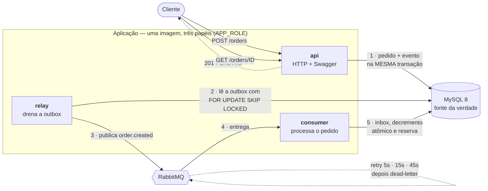
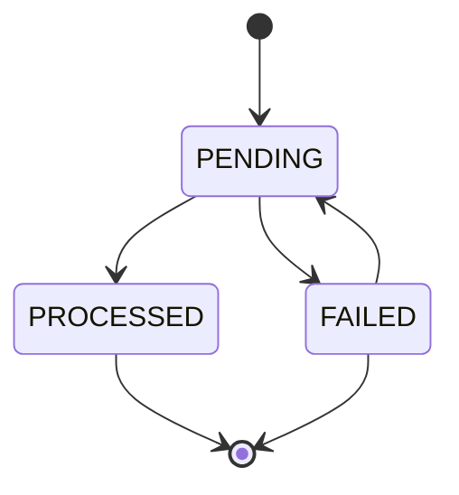

# Async Order Processor

Backend de pedidos com processamento assíncrono. A API aceita o pedido, grava e
responde `201 PENDING` imediatamente; a validação e a reserva de estoque
acontecem fora do ciclo da requisição, consumidas de uma fila, com retentativa
escalonada, dead-letter e proteção contra *overselling* sob concorrência.

**Stack:** NestJS 11 · TypeScript estrito · MySQL 8 · TypeORM · RabbitMQ · Docker Compose · Jest · k6

---

## Arquitetura



A API nunca fala com o broker. O desacoplamento é pela outbox, e há teste de
arquitetura que persegue também o caminho transitivo.

### Componentes

| Papel | Responsabilidade | Escala |
|---|---|---|
| `api` | Recebe HTTP, grava pedido + evento na mesma transação, expõe consulta e Swagger | horizontal |
| `relay` | Lê `outbox_messages` e publica no RabbitMQ | horizontal, sem disputa (`SKIP LOCKED`) |
| `consumer` | Consome `order.created`, decrementa estoque e grava a reserva | `--scale consumer=N` |

### Estados do pedido



`PENDING → PROCESSED` quando o estoque é reservado. `PENDING → FAILED` quando o
estoque é insuficiente, o produto não existe ou as retentativas se esgotam.
`FAILED → PENDING` só por `POST /orders/{id}/reprocess`, restrito ao papel `ADMIN`.

### Mecanismos

| Mecanismo | Implementação | Garante |
|---|---|---|
| Outbox transacional | Pedido e evento commitam juntos; o `relay` publica depois | Nenhum evento perdido, nenhum evento de pedido inexistente |
| Decremento condicional | `UPDATE products SET stock = stock - :q WHERE id = :id AND stock >= :q`, verificando `affectedRows` | Estoque nunca negativo, sem *overselling* |
| Idempotência camada 1 | `inbox_messages (consumer, event_id)` | Reentrega da mesma mensagem não reprocessa |
| Idempotência camada 2 | `UPDATE ... WHERE status = 'PENDING'` | Dois consumidores simultâneos, um só vence |
| Idempotência camada 3 | `UNIQUE (order_id, product_id)` | Nem o reprocessamento manual decrementa duas vezes |
| Ordem de lock | Itens processados em ordem crescente de `product_id` | Sem ciclo de espera no InnoDB |
| Retentativa | Filas de atraso com TTL + dead-letter-exchange | Sem `sleep` no consumidor segurando o prefetch |

O desenho completo — C4, ERD, diagramas de sequência e 18 ADRs — está em
[`docs/ARCHITECTURE.md`](./docs/ARCHITECTURE.md).

---

## Como rodar

**Pré-requisito:** Docker com Compose v2. Nada além disso.

```bash
docker compose up -d --wait
```

Sobe MySQL, RabbitMQ, roda as migrations e inicia os três papéis. O `--wait` só
retorna quando todos os *health checks* estão verdes.

| Endereço | O que é |
|---|---|
| http://localhost:3000/docs | **Swagger — todos os endpoints testáveis pelo navegador** |
| http://localhost:3000/health/ready | Readiness (verifica MySQL e RabbitMQ) |
| http://localhost:3000/health/live | Liveness |
| http://localhost:3000/metrics | Métricas Prometheus da API |
| http://localhost:3001/metrics | Métricas Prometheus do relay |
| http://localhost:15672 | UI do RabbitMQ (`orders` / `orders`) |

Para parar:

```bash
docker compose down        # mantém os dados
docker compose down -v     # apaga o volume do MySQL
```

### Pelo Swagger

1. **`POST /auth/login`** → *Try it out* → exemplo **cliente** → *Execute*.
2. Copie o `accessToken`, clique em **Authorize** (cadeado, topo direito), cole
   e confirme. O token persiste entre recarregamentos.
3. **`POST /orders`** → o seletor traz quatro exemplos prontos: pedido válido,
   estoque insuficiente, gatilho de falha e produto inexistente.
4. **`GET /orders/{id}`** alguns segundos depois — o worker já concluiu.
5. **`POST /orders/{id}/reprocess`** exige papel `ADMIN`: refaça o passo 1 com o
   exemplo **operador** (`admin@loja.test`).

### Pelo terminal

```bash
# 1. autentica (usuários semeados por migration)
TOKEN=$(curl -s -X POST localhost:3000/auth/login \
  -H 'content-type: application/json' \
  -d '{"email":"cliente@loja.test","password":"cliente123"}' | jq -r .accessToken)

# 2. cria o pedido — responde 201 PENDING na hora, sem falar com o broker
curl -s -X POST localhost:3000/orders \
  -H "authorization: Bearer $TOKEN" -H 'content-type: application/json' \
  -d '{"customerName":"Ana Souza","items":[
        {"productName":"Teclado Mecanico","quantity":2,"price":"249.90"},
        {"productName":"Mouse Sem Fio","quantity":3,"price":"89.90"}]}' | jq

# 3. segundos depois, o worker concluiu
curl -s localhost:3000/orders/<id> -H "authorization: Bearer $TOKEN" | jq '.status, .total'
#> "PROCESSED"
#> "769.50"
```

O roteiro completo — estoque insuficiente, gatilho de falha e reprocessamento —
está em [`requests/orders.http`](./requests/orders.http).

### Repor o estoque

O catálogo nasce com **5 unidades** de cada produto. Esgotado o estoque, todo
pedido novo volta `FAILED` com `INSUFFICIENT_STOCK`.

```bash
npm run db:reset-stock   # repõe as 5 unidades, mantendo os pedidos já criados
npm run db:reset         # estado de fábrica: apaga o volume e roda as migrations
```

### Verificar a proteção contra overselling

Dez pedidos simultâneos de uma unidade do mesmo produto, com estoque 5:

```bash
for i in $(seq 1 10); do
  curl -s -o /dev/null -X POST localhost:3000/orders \
    -H "authorization: Bearer $TOKEN" -H 'content-type: application/json' \
    -d "{\"customerName\":\"Cliente $i\",\"items\":[{\"productName\":\"Webcam Full HD\",\"quantity\":1,\"price\":\"199.99\"}]}" &
done; wait
```

Resultado esperado: estoque final `0`, cinco pedidos `PROCESSED`, cinco `FAILED`
com `INSUFFICIENT_STOCK`, cinco reservas. O estoque não fica negativo em nenhum
instante.

---

## Endpoints

| Método | Rota | Papel exigido | Descrição |
|---|---|---|---|
| `POST` | `/auth/login` | público | Troca credenciais por um JWT |
| `POST` | `/orders` | autenticado | Cria o pedido e responde `201 PENDING` |
| `GET` | `/orders` | autenticado | Lista pedidos paginados (`page`, `limit` ≤ 100, `status`) |
| `GET` | `/orders/{id}` | autenticado | Consulta um pedido, com status e motivo da falha |
| `POST` | `/orders/{id}/reprocess` | `ADMIN` | Reenfileira um pedido `FAILED`, responde `202` |
| `GET` | `/health/live` | público | O processo está vivo |
| `GET` | `/health/ready` | público | MySQL e RabbitMQ acessíveis; `503` se não |
| `GET` | `/metrics` | público | Exposição Prometheus do processo |

Credenciais semeadas: `cliente@loja.test` / `cliente123` (papel `CUSTOMER`) e
`admin@loja.test` / `admin123` (papel `ADMIN`).

**Cada cliente vê apenas os próprios pedidos.** `GET /orders` filtra pela
identidade do token e `GET /orders/{id}` responde `404` — não `403` — para o
pedido de outra pessoa, porque um `403` confirmaria que o id existe. O papel
`ADMIN` enxerga todos.

Valores monetários trafegam como **string decimal** no JSON, nunca como número.

---

## Configuração

Todas as variáveis estão documentadas em [`.env.example`](./.env.example). As
principais:

| Variável | Padrão | O que faz |
|---|---|---|
| `APP_ROLE` | `api` | Papel do processo: `api`, `relay` ou `consumer` |
| `HTTP_PORT` | `3000` | Porta da API |
| `DB_POOL_SIZE` | `20` | Pool de conexões; precisa ser maior que o paralelismo esperado |
| `AMQP_PREFETCH` | `10` | Mensagens em voo por consumidor |
| `RETRY_TIERS_MS` | `5000,15000,45000` | Degraus de espera; três degraus = três retentativas |
| `PROCESSING_DELAY_MS` | `1500` | *Sleep* que representa a validação de estoque |
| `OUTBOX_POLL_INTERVAL_MS` | `500` | Intervalo do ciclo do relay |
| `RETENTION_DAYS` | `30` | Dias de histórico mantidos em `outbox_messages` e `inbox_messages` |
| `AUTH_PROVIDER` | `local` | Provedor de identidade: `local` ou `keycloak` |
| `LOG_LEVEL` | `info` | Nível do log estruturado |

Portas do MySQL e do RabbitMQ também são configuráveis (`MYSQL_PORT`,
`RABBITMQ_PORT`, `RABBITMQ_UI_PORT`).

---

## Autenticação

Dois provedores atrás das mesmas portas (`TokenVerifier` e
`CredentialsAuthenticator`). `AUTH_PROVIDER` escolhe qual sobe; nenhum caso de
uso, controller ou guard sabe qual está ativo.

| | `local` (padrão) | `keycloak` |
|---|---|---|
| Emissão | tabela `users` + scrypt, JWT **HS256** | *password grant* no Keycloak, JWT **RS256** |
| Verificação | segredo compartilhado | chave pública do **JWKS**, em cache |
| Papéis | coluna `users.role` | claim `realm_access.roles`, filtrado por allowlist |
| Tempo de subida | instantâneo | ~30 s (container do Keycloak) |

```bash
docker compose up -d --wait     # local
npm run keycloak:up             # com Keycloak (console em http://localhost:8081, admin/admin)
```

As credenciais e o fluxo do Swagger são idênticos nos dois modos.

A validação do token **não chama o provedor**: a chave pública vem do JWKS uma
vez e fica em cache com TTL, limite de renovação por `kid` e reuso da chave
anterior se a renovação falhar. Um `kid` desconhecido dispara no máximo uma
busca por janela.

---

## Testes

A suíte tem cinco níveis. Os dois primeiros rodam em segundos, sem Docker; os
outros três precisam de MySQL e RabbitMQ de verdade.

### Sem Docker — o loop de desenvolvimento

```bash
npm install
npm run test:fast          # arquitetura + unitários, ~7 s
```

### Com Docker — a suíte inteira

```bash
docker compose -f docker-compose.test.yml up -d --wait   # MySQL + RabbitMQ de teste
npm run test:all                                          # 710 testes
```

Se a stack principal já estiver de pé (`docker compose up -d --wait`), ela serve
igual — `docker-compose.test.yml` existe para não misturar os dados de quem está
explorando a API com os de quem está rodando teste.

### Cada nível separadamente

| Comando | O que roda | Testes | Docker |
|---|---|---:|:---:|
| `npm run test:arch` | fitness functions: fronteiras entre camadas, ciclos de import, nomenclatura, invariantes | 57 | não |
| `npm run test:unit` | unitários, sem I/O | 483 | não |
| `npm run test:fast` | as duas acima | 540 | não |
| `npm run test:bdd` | cenários Gherkin contra a aplicação de pé | 114 | sim |
| `npm run test:int` | integração técnica: repositórios, schema, topologia AMQP, shutdown | 49 | sim |
| `npm run test:concurrency` | paralelismo real com barreira de largada | 7 | sim |
| `npm run test:all` | tudo, na ordem da pirâmide | **710** | sim |

### Cobertura e mutação

```bash
npm run test:cov           # cobertura, com os pisos aplicados
npm run test:mutation      # Stryker: ~4 min
```

| Métrica | Piso | Medido |
|---|---:|---:|
| Statements · Linhas · Funções | 100% | **100%** |
| Branches | 85% | **85,3%** |
| Mutation score (domínio + aplicação) | 95% | **100%** |

O mutation testing existe porque cobertura mede linha executada, não asserção
feita: o Stryker estraga o código de propósito, um ponto por vez, e verifica se
algum teste quebra. Zero mutantes sobreviventes.

### O que está escrito em Gherkin

**13 arquivos `.feature`, 75 cenários**, todos rastreáveis a uma das 13 user
stories. `autenticacao.feature` roda duas vezes, uma por provedor de identidade.

---

## Testes de carga

Precisam do [k6](https://k6.io/docs/get-started/installation/) instalado e da
stack de pé (`docker compose up -d --wait`).

```bash
npm run load:smoke        # sanidade: a instrumentação mede o que deveria
npm run load:create       # carga no POST /orders — o caminho síncrono
npm run load:e2e          # pedido até PROCESSED — atravessa outbox, fila e worker
npm run load:oversell     # 40 pedidos simultâneos contra estoque 5
npm run load:stress       # rampa até a saturação
```

Todos, menos o smoke, repõem o ambiente antes de rodar (`load/prep.sh`): limpar
só o banco não basta, porque as mensagens já publicadas continuam no RabbitMQ e
a rodada mediria fila represada em vez de latência.

### Ajustando a carga

```bash
VUS=100 HOLD=60s k6 run load/k6/create-order.js
STAGES=50,100,200,400 STAGE_DURATION=30s k6 run load/k6/stress.js
BASE_URL=http://outra-maquina:3000 k6 run load/k6/smoke.js
```

### Números medidos

Máquina local, stack em containers. Metodologia em
[`load/README.md`](./load/README.md).

| Cenário | Resultado |
|---|---|
| `POST /orders` (30 VUs) | 216 req/s, p95 203 ms, 0 erro em 15.184 requisições |
| Pedido até `PROCESSED` | 1,93 s em média (*sleep* de 1,5 s + ciclo do relay) |
| Vazão do worker | 6,4 /s com 1 consumidor · 14,1 /s com 3 |
| 40 pedidos simultâneos, estoque 5 | 5 `PROCESSED`, 35 `FAILED`, 0 preso |

**Onde satura.** A rampa mostra vazão constante e latência crescendo linear com
a concorrência — o sistema enfileira em vez de falhar:

| VUs | p95 | Vazão | Erro |
|---:|---:|---:|---:|
| 25 | 85 ms | 379 req/s | 0% |
| 50 | 163 ms | 374 req/s | 0% |
| 100 | 316 ms | 397 req/s | 0% |
| 200 | 587 ms | 412 req/s | 0% |
| 400 | 1,2 s | 397 req/s | 0% |
| 800 | 2,4 s | 390 req/s | 0% |
| 1500 | 4,1 s | 397 req/s | 0% |

A saturação é de **vazão, em ~400 req/s, alcançada já com 25 VUs**. Acima disso
a concorrência extra vira latência e nada mais: nenhum erro até 1500 VUs, nenhum
esgotamento do pool de conexões, nenhuma requisição recusada.

Com o worker saturado, o tempo até a conclusão subiu de 2 s para 26 s enquanto o
`POST` permaneceu em 80 ms — que é a prova de que a fila é real e não uma
chamada síncrona disfarçada.

## Observabilidade

Todo log é JSON com `correlationId`, que nasce no `POST /orders` (ou é herdado do
header `x-correlation-id` enviado pelo cliente), é gravado em
`orders.correlation_id`, viaja no payload do evento e no header AMQP, e aparece
em cada linha dos três processos. O id volta no header e no corpo da resposta,
inclusive nas respostas de erro.

```bash
docker compose logs api relay consumer | grep '"correlationId":"<id>"'
```

```
api        04:49:57.303  Requisicao concluida
relay      04:49:57.662  Evento publicado
consumer   04:49:59.175  Mensagem processada
```

A linha ausente indica onde o fluxo parou:

| O que aparece | Onde parou | Como confirmar |
|---|---|---|
| só a linha da API | no relay — o evento está na outbox, não publicado | `SELECT status, attempts, last_error FROM outbox_messages WHERE aggregate_id = '<id>'` |
| API e relay, sem consumidor | no worker — publicado, não consumido | profundidade de `orders.created` na UI do RabbitMQ |
| os três, e o pedido segue `PENDING` | no processamento — caiu antes do commit | `SELECT * FROM inbox_messages WHERE order_id = '<id>'` e a fila `orders.dead` |

`outbox_messages.last_error` guarda o motivo da falha de publicação;
`orders.failure_reason` guarda o motivo da falha de processamento.

Senha, token e o header `authorization` são redigidos na origem.

---

### Métricas Prometheus

Cada papel expõe `/metrics` no próprio processo, porque cada um tem números
diferentes. Prometheus raspa os três.

| Endereço | Papel | O que publica |
|---|---|---|
| http://localhost:3000/metrics | `api` | `orders_created_total`, `http_request_duration_seconds` |
| http://localhost:3001/metrics | `relay` | `outbox_pending_messages`, `outbox_oldest_pending_seconds` |
| `consumer:3000/metrics` (rede do compose) | `consumer` | `orders_processed_total{outcome}` |

```bash
curl -s localhost:3000/metrics | grep orders_created_total
curl -s localhost:3001/metrics | grep outbox_
```

As gauges da outbox só são registradas no papel `relay` — é ele quem as
alimenta. Registrá-las em todo processo faria a API publicar
`outbox_pending_messages 0` para sempre: uma série que parece saudável e nunca
foi medida.

O consumidor não publica porta no host de propósito: com
`--scale consumer=3` um mapeamento fixo colidiria.

## Estrutura de pastas

```
src/
├── domain/          entidades, value objects e portas — sem framework, ORM ou broker
├── shared/          conversão entre domínio e borda
├── application/     casos de uso, um por pasta
├── infrastructure/  persistência, mensageria, segurança, observabilidade, config
├── interface/http/  controllers, DTOs, guards, filtro e Swagger — vertical por recurso
└── workers/         relay e consumer
features/            especificação executável em Gherkin
test/                architecture · unit · bdd · integration · concurrency
load/k6/             cenários de carga
docs/                arquitetura, histórias, estratégia de testes e plano
```

As fronteiras entre camadas são verificadas por `test/architecture/` e pelo lint
(`eslint-plugin-boundaries`); import que atravesse fronteira quebra o CI.

---

## Documentação

| Documento | Conteúdo |
|---|---|
| [`docs/ARCHITECTURE.md`](./docs/ARCHITECTURE.md) | C4, ERD, máquinas de estado, diagramas de sequência, 18 ADRs, concorrência, idempotência |
| [`docs/USER_STORIES.md`](./docs/USER_STORIES.md) | 13 histórias com critérios de aceite e rastreabilidade |
| [`docs/TESTING.md`](./docs/TESTING.md) | Os cinco níveis e a matriz de qual teste prova qual coisa |
| [`docs/PLAN.md`](./docs/PLAN.md) | Ordem de execução, fase a fase |
| [`RESPOSTAS.md`](./RESPOSTAS.md) | As cinco perguntas de arquitetura do enunciado |
| [`features/`](./features/) | 13 arquivos Gherkin em português, 75 cenários |
| [`load/README.md`](./load/README.md) | Testes de carga com k6: metodologia, números e limites |
