# ARCHITECTURE.md — Async Order Processor

Backend de pedidos com processamento assíncrono: a API aceita o pedido e responde
imediatamente; a validação e a reserva de estoque acontecem fora do caminho da
requisição, consumidas de uma fila real, com retentativa, dead-letter e proteção
contra *overselling* sob concorrência.

**Stack:** NestJS 11 · TypeScript estrito · MySQL 8 · TypeORM · RabbitMQ · Docker Compose · Jest

**Documentos irmãos:** [`USER_STORIES.md`](./USER_STORIES.md) (histórias e critérios de
aceite) · [`TESTING.md`](./TESTING.md) (TDD, BDD e a matriz de testes) ·
[`PLAN.md`](./PLAN.md) (ordem de execução, fase a fase)

---

## Sumário

1. [Princípio ordenador](#1-princípio-ordenador)
2. [Modelo C4](#2-modelo-c4)
3. [Requisitos e rastreabilidade](#3-requisitos-e-rastreabilidade)
4. [Requisitos não funcionais](#4-requisitos-não-funcionais)
5. [Modelo de domínio](#5-modelo-de-domínio)
6. [Schema e invariantes no banco](#6-schema-e-invariantes-no-banco)
7. [Máquinas de estado](#7-máquinas-de-estado)
8. [Topologia RabbitMQ](#8-topologia-rabbitmq)
9. [Diagramas de sequência](#9-diagramas-de-sequência)
10. [Decisões arquiteturais (ADRs)](#10-decisões-arquiteturais-adrs)
11. [Concorrência](#11-concorrência)
12. [Idempotência](#12-idempotência)
13. [Mensageria: classificação de erro e parâmetros](#13-mensageria-classificação-de-erro-e-parâmetros)
14. [Observabilidade](#14-observabilidade)
15. [Estratégia de testes](#15-estratégia-de-testes)
16. [Autenticação e autorização (fase posterior)](#16-autenticação-e-autorização-fase-posterior)

---

## 1. Princípio ordenador

O enunciado descreve um sistema simples, mas ele esconde **dois problemas difíceis**
que decidem o desenho inteiro:

1. **Dual write.** `POST /orders` precisa gravar o pedido no MySQL **e** publicar
   `order.created` no RabbitMQ. São dois sistemas diferentes, sem transação
   distribuída entre eles. Se a aplicação grava e morre antes de publicar, o pedido
   fica `PENDING` para sempre e ninguém percebe. Se publica antes de gravar (ou usa
   `autoCommit` otimista), o consumidor pode receber um evento de um pedido que não
   existe no banco.
2. **Overselling sob concorrência.** Dois pedidos do mesmo produto, processados em
   paralelo por instâncias diferentes do worker, podem ler `stock = 5` ao mesmo
   tempo e ambos decrementar, deixando o estoque negativo.

Nenhum dos dois é resolvido por "código mais cuidadoso" — os dois exigem uma decisão
estrutural. Este projeto resolve o primeiro com **Transactional Outbox** e o segundo
com **decremento condicional atômico no próprio MySQL**, respaldado por uma tabela de
reservas com chave única que torna o efeito idempotente.

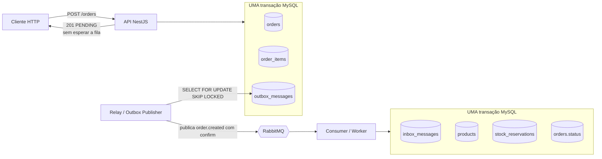
```mermaid
flowchart LR
    C[Cliente HTTP] -->|POST /orders| API[API NestJS]

    subgraph TX["UMA transação MySQL"]
        O[(orders)]
        OI[(order_items)]
        OB[(outbox_messages)]
    end

    API --> TX
    API -->|201 PENDING<br/>sem esperar a fila| C

    REL["Relay / Outbox Publisher"] -->|SELECT FOR UPDATE SKIP LOCKED| OB
    REL -->|publica order.created com confirm| MQ{{RabbitMQ}}
    MQ --> W[Consumer / Worker]

    subgraph TX2["UMA transação MySQL"]
        IN[(inbox_messages)]
        P[(products)]
        SR[(stock_reservations)]
        O2[(orders.status)]
    end

    W --> TX2
```

Quatro invariantes governam tudo o que vem a seguir:

1. **Nenhum pedido aceito fica sem evento.** Se `orders` tem a linha, `outbox_messages`
   tem a mensagem — foram gravadas na mesma transação.
2. **Nenhum estoque fica negativo**, em nenhuma ordem de intercalação de workers.
3. **Nenhum pedido decrementa o estoque duas vezes**, mesmo com reentrega da fila ou
   reprocessamento manual.
4. **Nenhum pedido morre em silêncio.** Todo desfecho é `PROCESSED` ou `FAILED` com
   motivo legível, e toda mensagem esgotada vai para uma dead-letter inspecionável.

Tudo o mais neste documento é consequência dessas quatro frases.

---

## 2. Modelo C4

### 2.1 Nível 1 — Contexto

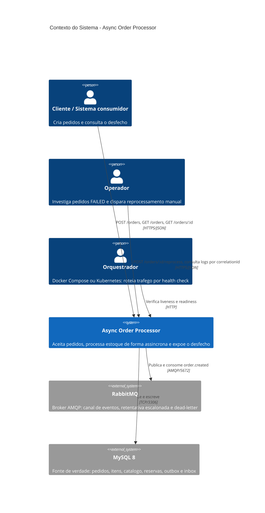
```mermaid
C4Context
    title Contexto do Sistema - Async Order Processor

    Person(customer, "Cliente / Sistema consumidor", "Cria pedidos e consulta o desfecho")
    Person(operator, "Operador", "Investiga pedidos FAILED e dispara reprocessamento manual")
    Person(orchestrator, "Orquestrador", "Docker Compose ou Kubernetes: roteia trafego por health check")

    System(aop, "Async Order Processor", "Aceita pedidos, processa estoque de forma assincrona e expoe o desfecho")

    System_Ext(mq, "RabbitMQ", "Broker AMQP: canal de eventos, retentativa escalonada e dead-letter")
    System_Ext(db, "MySQL 8", "Fonte de verdade: pedidos, itens, catalogo, reservas, outbox e inbox")

    Rel(customer, aop, "POST /orders, GET /orders, GET /orders/:id", "HTTPS/JSON")
    Rel(operator, aop, "POST /orders/:id/reprocess, consulta logs por correlationId", "HTTPS/JSON")
    Rel(orchestrator, aop, "Verifica liveness e readiness", "HTTP")
    Rel(aop, db, "Le e escreve", "TCP/3306")
    Rel(aop, mq, "Publica e consome order.created", "AMQP/5672")
```

**Justificativa do recorte.** O operador aparece como ator separado do cliente porque
o enunciado pede um endpoint de reprocessamento manual: quem opera o sistema tem um
caso de uso próprio, e é ele quem consome a observabilidade. Modelar os dois como
"usuário" esconderia que o reprocessamento é uma ação administrativa — que na fase de
autenticação (seção 16) será restrita por papel.

### 2.2 Nível 2 — Contêineres

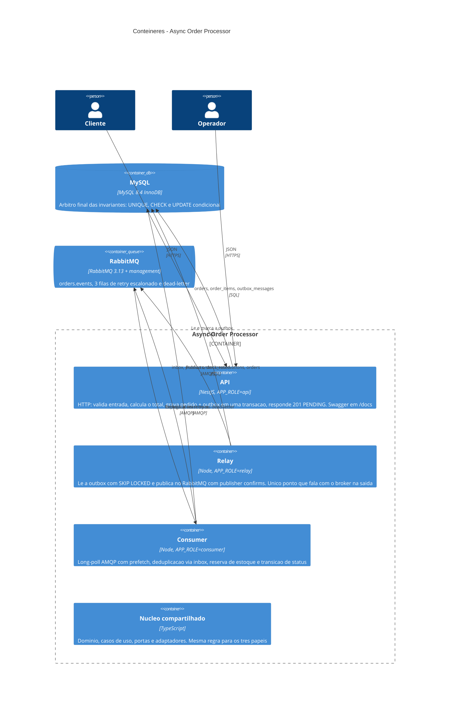
```mermaid
C4Container
    title Conteineres - Async Order Processor

    Person(customer, "Cliente", "")
    Person(operator, "Operador", "")

    Container_Boundary(sys, "Async Order Processor") {
        Container(api, "API", "NestJS, APP_ROLE=api", "HTTP: valida entrada, calcula o total, grava pedido + outbox em uma transacao, responde 201 PENDING. Swagger em /docs")
        Container(relay, "Relay", "Node, APP_ROLE=relay", "Le a outbox com SKIP LOCKED e publica no RabbitMQ com publisher confirms. Unico ponto que fala com o broker na saida")
        Container(consumer, "Consumer", "Node, APP_ROLE=consumer", "Long-poll AMQP com prefetch, deduplicacao via inbox, reserva de estoque e transicao de status")
        Container(core, "Nucleo compartilhado", "TypeScript", "Dominio, casos de uso, portas e adaptadores. Mesma regra para os tres papeis")
    }

    ContainerDb(mysql, "MySQL", "MySQL 8.4 InnoDB", "Arbitro final das invariantes: UNIQUE, CHECK e UPDATE condicional")
    ContainerQueue(mq, "RabbitMQ", "RabbitMQ 3.13 + management", "orders.events, 3 filas de retry escalonado e dead-letter")

    Rel(customer, api, "JSON", "HTTPS")
    Rel(operator, api, "JSON", "HTTPS")
    Rel(api, mysql, "orders, order_items, outbox_messages", "SQL")
    Rel(relay, mysql, "Le e marca a outbox", "SQL")
    Rel(relay, mq, "Publica order.created", "AMQP")
    Rel(mq, consumer, "Entrega at-least-once", "AMQP")
    Rel(consumer, mysql, "inbox, products, stock_reservations, orders", "SQL")
    Rel(consumer, mq, "Republica em retry ou dead-letter", "AMQP")
```

**Por que três papéis e não três serviços.** É um monólito modular: uma única imagem
Docker, um único `main.ts`, e a variável `APP_ROLE` decide o que aquele processo faz.
Isso dá o que interessa — **processos separados, escaláveis de forma independente**
(`docker compose up --scale consumer=3`) — sem o custo de três repositórios, três
pipelines e três cópias da mesma regra de negócio para um teste de sete dias. A
fronteira para extrair um microsserviço de verdade já está desenhada: o dia em que o
consumer precisar de um ciclo de deploy próprio, ele sai com a pasta
`src/workers/consumer` e as portas que ela usa.

**Por que o relay é um papel separado do API.** Se a própria API publicasse a outbox
(por exemplo, num `setInterval` após o commit), o throughput de publicação ficaria
amarrado ao número de réplicas da API, e um pico de tráfego HTTP competiria com a
drenagem da fila pelo mesmo event loop. Separado, ele escala por uma dimensão
diferente e sobrevive à API estar fora do ar.

### 2.3 Nível 3 — Componentes do núcleo

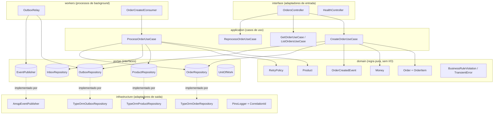
```mermaid
flowchart TB
    subgraph interface["interface (adaptadores de entrada)"]
        OC[OrdersController]
        HC[HealthController]
    end

    subgraph application["application (casos de uso)"]
        CO[CreateOrderUseCase]
        PO[ProcessOrderUseCase]
        RO[ReprocessOrderUseCase]
        GO["GetOrderUseCase / ListOrdersUseCase"]
    end

    subgraph domain["domain (regra pura, sem I/O)"]
        ORD[Order + OrderItem]
        MON[Money]
        PRD[Product]
        RP[RetryPolicy]
        EV[OrderCreatedEvent]
        ERR["BusinessRuleViolation / TransientError"]
    end

    subgraph ports["portas (interfaces)"]
        POR[(OrderRepository)]
        PPR[(ProductRepository)]
        POU[(OutboxRepository)]
        PIN[(InboxRepository)]
        PPU[(EventPublisher)]
        PUOW[(UnitOfWork)]
    end

    subgraph infra["infrastructure (adaptadores de saida)"]
        TOR[TypeOrmOrderRepository]
        TPR[TypeOrmProductRepository]
        TOU[TypeOrmOutboxRepository]
        AMQ[AmqpEventPublisher]
        LOG[PinoLogger + CorrelationId]
    end

    subgraph workers["workers (processos de background)"]
        REL[OutboxRelay]
        CON[OrderCreatedConsumer]
    end

    OC --> CO
    OC --> GO
    OC --> RO
    CON --> PO
    REL --> POU
    REL --> PPU

    CO --> ORD
    CO --> MON
    PO --> PRD
    PO --> RP
    CO --> EV

    CO --> POR
    CO --> POU
    PO --> PPR
    PO --> PIN
    PO --> POR

    POR -.implementado por.-> TOR
    PPR -.implementado por.-> TPR
    POU -.implementado por.-> TOU
    PPU -.implementado por.-> AMQ
```

A seta que importa é a pontilhada: **o domínio e a aplicação não conhecem TypeORM nem
amqplib**. Eles dependem de interfaces declaradas em `domain/ports`, e o módulo raiz
faz o *binding*. É isso que permite testar `ProcessOrderUseCase` com dublês em
milissegundos e, ao mesmo tempo, testar o repositório real contra um MySQL de verdade.

### 2.4 Estrutura de pastas

```text
src/
├── main.ts                          # seleciona o papel via APP_ROLE
├── domain/
│   ├── order/
│   │   ├── order.entity.ts          # agregado Order, transições de status
│   │   ├── order-item.entity.ts
│   │   ├── order-status.enum.ts
│   │   ├── order-total.calculator.ts# <- alvo do teste unitário obrigatório
│   │   └── events/order-created.event.ts
│   ├── product/product.entity.ts
│   ├── stock/stock-reservation.entity.ts
│   ├── shared/
│   │   ├── money.vo.ts              # decimal.js, nunca float
│   │   ├── errors/                  # um arquivo por erro, não um balaio
│   │   │   ├── failure-code.enum.ts # o vocabulário de códigos que vai para failure_code
│   │   │   ├── domain.error.ts      # raiz abstrata: código + mensagem
│   │   │   ├── business-rule-violation.error.ts
│   │   │   ├── validation.error.ts
│   │   │   ├── not-found.error.ts
│   │   │   ├── conflict.error.ts
│   │   │   ├── transient.error.ts   # fora da família: este se retenta
│   │   │   └── business-error.guard.ts
│   │   └── retry-policy.ts          # <- alvo do teste unitário obrigatório
│   └── ports/                       # uma porta por arquivo, com o token dela
│       ├── repositories/            # order, product, stock, outbox, inbox, user
│       ├── system/                  # clock, id, hasher, issuer, verifier, probe
│       ├── pagination.port.ts
│       └── unit-of-work.port.ts
├── shared/                          # conversão pura entre domínio e borda
│   └── transformers/                # Money↔DECIMAL, BIGINT↔number, sem ORM junto
├── application/
│   ├── create-order/
│   ├── process-order/               # o coração: reserva de estoque idempotente
│   ├── reprocess-order/
│   └── query-orders/
├── infrastructure/
│   ├── persistence/                 # uma pasta por agregado; a raiz só compõe
│   │   ├── order/                   # order.repository.ts + os EntitySchema dele
│   │   ├── product/
│   │   ├── stock/
│   │   ├── outbox/                  # outbox.repository.ts e outbox-dispatch.repository.ts
│   │   ├── inbox/
│   │   ├── user/
│   │   ├── errors/                  # mysql.errors.ts: o que é transitório no driver
│   │   ├── datasource/              # opções do TypeORM e a datasource da CLI
│   │   ├── unit-of-work/            # a transação que envolve pedido + outbox
│   │   ├── health/                  # mysql.probe.ts
│   │   ├── migrations/
│   │   ├── entities.ts              # índice dos EntitySchema para a datasource
│   │   └── persistence.module.ts
│   ├── messaging/
│   │   ├── amqp/                    # conexão, topologia, sonda
│   │   ├── codec/                   # envelope da mensagem
│   │   ├── orders/                  # publisher e consumer de order.created
│   │   ├── messaging.constants.ts
│   │   └── messaging.module.ts
│   ├── observability/               # pino, correlation id, interceptor
│   ├── security/
│   │   ├── tokens/                  # emissão e verificação de JWT local
│   │   ├── authentication/          # autenticação por credenciais
│   │   ├── hashing/                 # scrypt
│   │   ├── keycloak/                # JWKS, verificador, papéis
│   │   └── security.module.ts
│   └── config/                      # env schema validado na subida
├── interface/http/                  # vertical por recurso; a raiz só compõe
│   ├── orders/                      # controller + presenter + dto/
│   ├── auth/                        # controller + dto/
│   ├── health/                      # controller + dto/
│   ├── common/                      # o que é de todo recurso
│   │   ├── guards/  decorators/  filters/  dto/
│   ├── docs/                        # Swagger: decorators compostos e setup
│   ├── http.constants.ts
│   └── http.module.ts
├── workers/
│   ├── relay/                       # publica a outbox
│   └── consumer/                    # consome order.created
├── app.module.ts                    # composition root: liga todas as camadas
└── readiness.module.ts              # monta as sondas de MySQL e RabbitMQ

features/                            # especificacao executavel em Gherkin (pt)
└── *.feature                        # 8 arquivos, 82 casos — ver USER_STORIES.md

test/
├── architecture/                    # fitness functions: fronteiras, nomes, invariantes
├── unit/                            # sem I/O
├── bdd/                             # step definitions dos .feature (jest-cucumber)
├── integration/                     # MySQL e RabbitMQ reais (o que nao e cenario de negocio)
├── concurrency/                     # paralelismo real com barreira de largada
└── support/                         # subida da app, banco de teste, barreira, limpeza
```

O método de desenvolvimento — TDD com BDD por fora, e a matriz completa de qual
teste prova qual coisa — está em [`TESTING.md`](./TESTING.md). As histórias e os
critérios de aceite, em [`USER_STORIES.md`](./USER_STORIES.md).

---

## 3. Requisitos e rastreabilidade

Cada linha do enunciado mapeada para onde ela é resolvida e para o teste que a prova.

| # | Requisito | Onde | Prova |
|---|---|---|---|
| RF1 | `POST /orders` calcula total, grava `PENDING`, publica `order.created` | `CreateOrderUseCase` + outbox | `criacao-de-pedido.feature` → `test/bdd/criacao-de-pedido.steps.spec.ts` |
| RF2 | Consumer processa assíncrono e marca `PROCESSED` | `workers/consumer` + `ProcessOrderUseCase` | `processamento-assincrono.feature` |
| RF3 | `GET /orders/:id` com status atual | `GetOrderUseCase` | `consulta-de-pedidos.feature` |
| RF4 | `GET /orders?page=&limit=` | `ListOrdersUseCase` | `consulta-de-pedidos.feature` |
| RF5 | Falha com retry + dead-letter + motivo salvo | `RetryPolicy` + topologia AMQP | `retry-e-dead-letter.feature` |
| RN1 | Reserva de estoque antes de `PROCESSED` | `ProcessOrderUseCase` | `estoque-reserva.feature` |
| RN2 | Estoque insuficiente ⇒ `FAILED` "estoque insuficiente" | `UPDATE ... WHERE stock >= ?` | `estoque-reserva.feature` |
| RN3 | Concorrência não pode gerar estoque negativo | decremento condicional atômico | `test/concurrency/oversell.spec.ts` |
| RN4 | Retry não decrementa duas vezes | `UNIQUE(order_id, product_id)` + inbox | `test/concurrency/idempotency.spec.ts` |
| RT1 | NestJS | — | — |
| RT2 | MySQL + TypeORM com migrations | `infrastructure/persistence` | migrations versionadas |
| RT3 | Fila real, sem chamar a lógica no controller | RabbitMQ + outbox | o controller não alcança `messaging`, nem transitivamente — `test/architecture/layer-boundaries.spec.ts` |
| RT4 | Testes: unitário, e2e e cenário real de falha | `test/` | seção 15 e a matriz completa em `TESTING.md` |
| RT5 | Docker Compose sobe tudo com um comando | `docker-compose.yml` | `docker compose up -d --wait` |
| RT6 | README com decisões e trade-offs | `README.md` + este documento | — |
| B1 | JWT com papéis | fase posterior (seção 16) | `autenticacao.feature` |
| B2 | Reprocessamento manual | `POST /orders/:id/reprocess` | `reprocessamento-manual.feature` |
| B3 | Eventos de domínio | `OrderCreatedEvent` + outbox | unitário |
| B4 | Swagger | `/docs` | manual |
| B5 | Log estruturado e correlation ID | Pino + AsyncLocalStorage | `observabilidade.feature` |

---

## 4. Requisitos não funcionais

### 4.1 Correção
- Dinheiro nunca trafega como `number`. `Money` encapsula `decimal.js` e persiste em
  `DECIMAL(12,2)`. Somar `0.1 + 0.2` em ponto flutuante 100 mil vezes por dia é como
  um sistema de pedidos passa a divergir do financeiro.
- O estoque é decrementado por uma instrução que **o próprio MySQL** avalia de forma
  atômica. A aplicação nunca decide, com base numa leitura anterior, se "cabe".

### 4.2 Concorrência
- O `POST /orders` não toca em `products` — logo, pedidos concorrentes não disputam
  linha nenhuma do catálogo no caminho síncrono.
- No worker, a unidade de contenção é a **linha do produto**. Itens do mesmo pedido são
  processados em ordem crescente de `product_id` para eliminar deadlock cruzado.

### 4.3 Desempenho
- `POST /orders` responde sem nenhuma chamada de rede ao broker: uma transação, dois
  ou três `INSERT`s. É o que permite o 201 imediato exigido pelo enunciado.
- O relay publica em lote (`SELECT ... LIMIT :batch FOR UPDATE SKIP LOCKED`) e
  paraleliza o despacho AMQP, mantendo os `UPDATE`s sequenciais na mesma conexão.

### 4.4 Confiabilidade
- Toda mensagem é consumida com **ack manual**, depois do commit no MySQL. Crash entre
  commit e ack gera reentrega, que a inbox absorve.
- Retentativa escalonada (5s → 15s → 45s) e dead-letter durável e inspecionável pela
  UI do RabbitMQ.
- Shutdown gracioso: `SIGTERM` para de consumir, espera as mensagens em voo terminarem
  e só então fecha canal e pool.

### 4.5 Observabilidade
- Log JSON estruturado com `correlationId` que nasce no `POST /orders`, viaja no
  payload do evento e no header AMQP, e reaparece em cada linha de log do consumer.
- Um `orderId` ou um `correlationId` responde, sozinho, a pergunta "onde este pedido
  parou".

### 4.6 Manutenibilidade
- Fronteiras entre camadas verificadas em tempo de lint (`eslint-plugin-boundaries`):
  `domain` não importa de `infrastructure`; `interface` não importa de `messaging`.
  A regra do enunciado "não vale chamar a lógica de processamento dentro do controller"
  deixa de ser boa intenção e passa a quebrar o CI.

---

## 5. Modelo de domínio

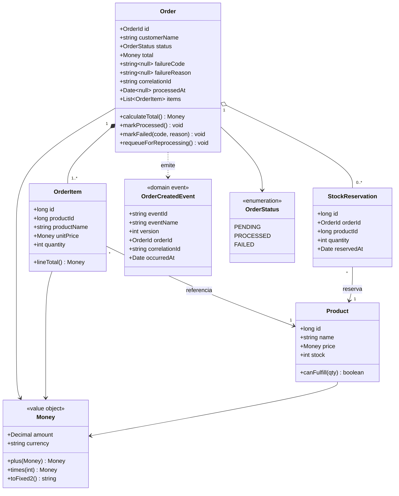
```mermaid
classDiagram
    class Order {
        +OrderId id
        +string customerName
        +OrderStatus status
        +Money total
        +string~null~ failureCode
        +string~null~ failureReason
        +string correlationId
        +Date~null~ processedAt
        +List~OrderItem~ items
        +calculateTotal() Money
        +markProcessed() void
        +markFailed(code, reason) void
        +requeueForReprocessing() void
    }

    class OrderItem {
        +long id
        +long productId
        +string productName
        +Money unitPrice
        +int quantity
        +lineTotal() Money
    }

    class Product {
        +long id
        +string name
        +Money price
        +int stock
        +canFulfill(qty) boolean
    }

    class StockReservation {
        +long id
        +OrderId orderId
        +long productId
        +int quantity
        +Date reservedAt
    }

    class Money {
        <<value object>>
        +Decimal amount
        +string currency
        +plus(Money) Money
        +times(int) Money
        +toFixed2() string
    }

    class OrderCreatedEvent {
        <<domain event>>
        +string eventId
        +string eventName
        +int version
        +OrderId orderId
        +string correlationId
        +Date occurredAt
    }

    class OrderStatus {
        <<enumeration>>
        PENDING
        PROCESSED
        FAILED
    }

    Order "1" *-- "1..*" OrderItem
    Order "1" o-- "0..*" StockReservation
    OrderItem "*" --> "1" Product : referencia
    StockReservation "*" --> "1" Product : reserva
    Order ..> OrderCreatedEvent : emite
    Order --> Money
    OrderItem --> Money
    Product --> Money
    Order --> OrderStatus
```

**Três decisões de modelagem que valem explicar:**

1. **`OrderItem` guarda um snapshot de `productName` e `unitPrice`.** Um pedido é um
   documento histórico: se o preço do produto mudar amanhã, o que foi cobrado ontem
   não pode mudar junto. A FK para `products` existe para a reserva de estoque, não
   para ler o preço.
2. **`StockReservation` é uma entidade, não um campo.** Poderia-se "saber" que o
   pedido reservou estoque olhando `orders.status = PROCESSED`. Materializar a reserva
   como linha própria, com `UNIQUE(order_id, product_id)`, transforma a idempotência
   em uma **constraint do banco** em vez de uma condição em código — e abre caminho
   para compensação (liberar estoque de pedido cancelado) sem mudar o schema.
3. **`Money` é objeto de valor imutável.** Não existe `order.total += x` em lugar
   nenhum; existe `total = total.plus(x)`.

---

## 6. Schema e invariantes no banco

### 6.1 Diagrama entidade-relacionamento

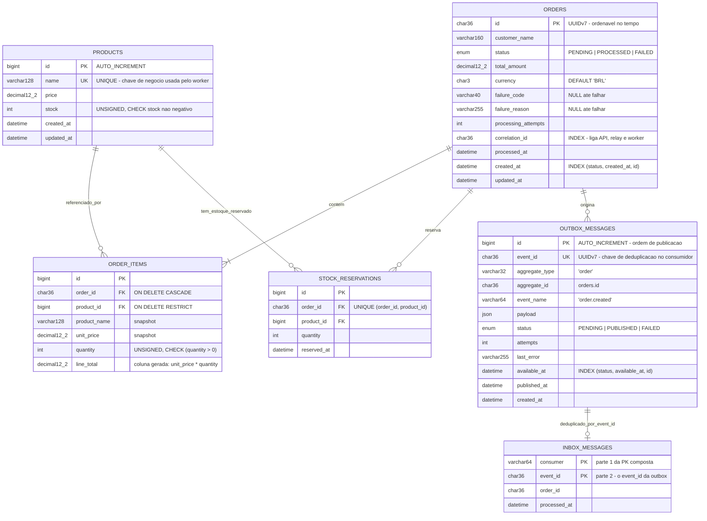
```mermaid
erDiagram
    PRODUCTS {
        bigint      id              PK "AUTO_INCREMENT"
        varchar128  name            UK "UNIQUE - chave de negocio usada pelo worker"
        decimal12_2 price
        int         stock              "UNSIGNED, CHECK stock nao negativo"
        datetime    created_at
        datetime    updated_at
    }

    ORDERS {
        char36      id              PK "UUIDv7 - ordenavel no tempo"
        varchar160  customer_name
        enum        status             "PENDING | PROCESSED | FAILED"
        decimal12_2 total_amount
        char3       currency           "DEFAULT 'BRL'"
        varchar40   failure_code       "NULL ate falhar"
        varchar255  failure_reason     "NULL ate falhar"
        int         processing_attempts
        char36      correlation_id     "INDEX - liga API, relay e worker"
        datetime    processed_at
        datetime    created_at      "INDEX (status, created_at, id)"
        datetime    updated_at
    }

    ORDER_ITEMS {
        bigint      id              PK
        char36      order_id        FK "ON DELETE CASCADE"
        bigint      product_id      FK "ON DELETE RESTRICT"
        varchar128  product_name       "snapshot"
        decimal12_2 unit_price         "snapshot"
        int         quantity           "UNSIGNED, CHECK (quantity > 0)"
        decimal12_2 line_total         "coluna gerada: unit_price * quantity"
    }

    STOCK_RESERVATIONS {
        bigint      id              PK
        char36      order_id        FK "UNIQUE (order_id, product_id)"
        bigint      product_id      FK
        int         quantity
        datetime    reserved_at
    }

    OUTBOX_MESSAGES {
        bigint      id              PK "AUTO_INCREMENT - ordem de publicacao"
        char36      event_id        UK "UUIDv7 - chave de deduplicacao no consumidor"
        varchar32   aggregate_type     "'order'"
        char36      aggregate_id       "orders.id"
        varchar64   event_name         "'order.created'"
        json        payload
        enum        status             "PENDING | PUBLISHED | FAILED"
        int         attempts
        varchar255  last_error
        datetime    available_at       "INDEX (status, available_at, id)"
        datetime    published_at
        datetime    created_at
    }

    INBOX_MESSAGES {
        varchar64   consumer        PK "parte 1 da PK composta"
        char36      event_id        PK "parte 2 - o event_id da outbox"
        char36      order_id
        datetime    processed_at
    }

    ORDERS                ||--|{ ORDER_ITEMS        : contem
    ORDERS                ||--o{ STOCK_RESERVATIONS : reserva
    ORDERS                ||--o{ OUTBOX_MESSAGES    : origina
    PRODUCTS              ||--o{ ORDER_ITEMS        : referenciado_por
    PRODUCTS              ||--o{ STOCK_RESERVATIONS : tem_estoque_reservado
    OUTBOX_MESSAGES       ||--o| INBOX_MESSAGES     : deduplicado_por_event_id
```

### 6.2 DDL com as invariantes explícitas

O que está no banco não é decoração: cada constraint abaixo corresponde a uma das
quatro invariantes da seção 1.

```sql
CREATE TABLE products (
  id          BIGINT UNSIGNED NOT NULL AUTO_INCREMENT,
  name        VARCHAR(128)    NOT NULL,
  price       DECIMAL(12,2)   NOT NULL,
  stock       INT UNSIGNED    NOT NULL DEFAULT 0,
  created_at  DATETIME(3)     NOT NULL DEFAULT CURRENT_TIMESTAMP(3),
  updated_at  DATETIME(3)     NOT NULL DEFAULT CURRENT_TIMESTAMP(3) ON UPDATE CURRENT_TIMESTAMP(3),
  PRIMARY KEY (id),
  UNIQUE KEY uq_products_name (name),
  CONSTRAINT ck_products_stock_non_negative CHECK (stock >= 0)
) ENGINE=InnoDB DEFAULT CHARSET=utf8mb4 COLLATE=utf8mb4_0900_ai_ci;

CREATE TABLE orders (
  id                  CHAR(36)      NOT NULL,
  customer_name       VARCHAR(160)  NOT NULL,
  status              ENUM('PENDING','PROCESSED','FAILED') NOT NULL DEFAULT 'PENDING',
  total_amount        DECIMAL(12,2) NOT NULL,
  currency            CHAR(3)       NOT NULL DEFAULT 'BRL',
  failure_code        VARCHAR(40)   NULL,
  failure_reason      VARCHAR(255)  NULL,
  processing_attempts INT UNSIGNED  NOT NULL DEFAULT 0,
  correlation_id      CHAR(36)      NOT NULL,
  processed_at        DATETIME(3)   NULL,
  created_at          DATETIME(3)   NOT NULL DEFAULT CURRENT_TIMESTAMP(3),
  updated_at          DATETIME(3)   NOT NULL DEFAULT CURRENT_TIMESTAMP(3) ON UPDATE CURRENT_TIMESTAMP(3),
  PRIMARY KEY (id),
  KEY ix_orders_created_at (created_at, id),
  KEY ix_orders_status_created_at (status, created_at, id),
  KEY ix_orders_correlation_id (correlation_id),
  CONSTRAINT ck_orders_failure_pair CHECK (
    (status = 'FAILED' AND failure_code IS NOT NULL)
    OR (status <> 'FAILED' AND failure_code IS NULL)
  )
) ENGINE=InnoDB DEFAULT CHARSET=utf8mb4 COLLATE=utf8mb4_0900_ai_ci;

CREATE TABLE order_items (
  id           BIGINT UNSIGNED NOT NULL AUTO_INCREMENT,
  order_id     CHAR(36)        NOT NULL,
  product_id   BIGINT UNSIGNED NOT NULL,
  product_name VARCHAR(128)    NOT NULL,
  unit_price   DECIMAL(12,2)   NOT NULL,
  quantity     INT UNSIGNED    NOT NULL,
  line_total   DECIMAL(12,2) AS (unit_price * quantity) STORED,
  PRIMARY KEY (id),
  UNIQUE KEY uq_order_items_order_product (order_id, product_id),
  KEY ix_order_items_product (product_id),
  CONSTRAINT fk_order_items_order   FOREIGN KEY (order_id)   REFERENCES orders(id)   ON DELETE CASCADE,
  CONSTRAINT fk_order_items_product FOREIGN KEY (product_id) REFERENCES products(id) ON DELETE RESTRICT,
  CONSTRAINT ck_order_items_quantity_positive CHECK (quantity > 0)
) ENGINE=InnoDB DEFAULT CHARSET=utf8mb4 COLLATE=utf8mb4_0900_ai_ci;

CREATE TABLE stock_reservations (
  id          BIGINT UNSIGNED NOT NULL AUTO_INCREMENT,
  order_id    CHAR(36)        NOT NULL,
  product_id  BIGINT UNSIGNED NOT NULL,
  quantity    INT UNSIGNED    NOT NULL,
  reserved_at DATETIME(3)     NOT NULL DEFAULT CURRENT_TIMESTAMP(3),
  PRIMARY KEY (id),
  UNIQUE KEY uq_stock_reservations_order_product (order_id, product_id),
  CONSTRAINT fk_stock_res_order   FOREIGN KEY (order_id)   REFERENCES orders(id)   ON DELETE CASCADE,
  CONSTRAINT fk_stock_res_product FOREIGN KEY (product_id) REFERENCES products(id) ON DELETE RESTRICT
) ENGINE=InnoDB DEFAULT CHARSET=utf8mb4 COLLATE=utf8mb4_0900_ai_ci;

CREATE TABLE outbox_messages (
  id             BIGINT UNSIGNED NOT NULL AUTO_INCREMENT,
  event_id       CHAR(36)        NOT NULL,
  aggregate_type VARCHAR(32)     NOT NULL,
  aggregate_id   CHAR(36)        NOT NULL,
  event_name     VARCHAR(64)     NOT NULL,
  payload        JSON            NOT NULL,
  status         ENUM('PENDING','PUBLISHED','FAILED') NOT NULL DEFAULT 'PENDING',
  attempts       INT UNSIGNED    NOT NULL DEFAULT 0,
  last_error     VARCHAR(255)    NULL,
  available_at   DATETIME(3)     NOT NULL DEFAULT CURRENT_TIMESTAMP(3),
  published_at   DATETIME(3)     NULL,
  created_at     DATETIME(3)     NOT NULL DEFAULT CURRENT_TIMESTAMP(3),
  PRIMARY KEY (id),
  UNIQUE KEY uq_outbox_event_id (event_id),
  KEY ix_outbox_dispatch (status, available_at, id)
) ENGINE=InnoDB DEFAULT CHARSET=utf8mb4 COLLATE=utf8mb4_0900_ai_ci;

CREATE TABLE inbox_messages (
  consumer     VARCHAR(64) NOT NULL,
  event_id     CHAR(36)    NOT NULL,
  order_id     CHAR(36)    NOT NULL,
  processed_at DATETIME(3) NOT NULL DEFAULT CURRENT_TIMESTAMP(3),
  PRIMARY KEY (consumer, event_id),
  KEY ix_inbox_order (order_id)
) ENGINE=InnoDB DEFAULT CHARSET=utf8mb4 COLLATE=utf8mb4_0900_ai_ci;
```

### 6.3 Por que cada índice existe

| Índice | Consulta que ele serve | Consequência de não ter |
|---|---|---|
| `ix_orders_created_at (created_at, id)` | `GET /orders` paginado, ordenado por data | *filesort* na tabela inteira a cada página |
| `ix_orders_status_created_at` | `GET /orders?status=FAILED`, varredura de pedidos presos | *full scan* filtrando em memória |
| `ix_orders_correlation_id` | investigação: "me mostre tudo do correlationId X" | investigação inviável em produção |
| `uq_products_name` | resolução `productName → product_id` no `POST` | *full scan* no catálogo por pedido |
| `ix_outbox_dispatch (status, available_at, id)` | o `SELECT` do relay, executado a cada 500 ms | o relay degrada linearmente com o histórico da outbox |
| `uq_stock_reservations_order_product` | **a** garantia de não decrementar duas vezes | overselling silencioso no retry |
| `uq_outbox_event_id` | deduplicação fim a fim | evento duplicado indetectável |

### 6.4 Escolha dos tipos

- **`orders.id` é `CHAR(36)` com UUIDv7, não `AUTO_INCREMENT`.** O id aparece na URL
  (`GET /orders/:id`) e em payloads que atravessam a fila. Um inteiro sequencial
  exposto vaza volume de negócio e permite enumeração. UUIDv7 (e não v4) porque o
  prefixo é timestamp: o índice clusterizado do InnoDB continua tendo inserção
  quase sequencial, evitando a fragmentação de página que o UUIDv4 causa.
- **`products.id` é `BIGINT AUTO_INCREMENT`.** Catálogo interno, nunca exposto, e
  usado como FK em três tabelas: 8 bytes contra 36 fazem diferença real no tamanho
  dos índices secundários.
- **`DECIMAL(12,2)` para dinheiro.** `FLOAT`/`DOUBLE` em coluna monetária é a origem
  clássica de centavo que não fecha. 12 dígitos cobrem até 9.999.999.999,99.
- **`stock` é `INT UNSIGNED` com `CHECK (stock >= 0)`.** Se algum caminho de código
  futuro tentar decrementar sem a cláusula condicional, o MySQL 8 recusa a escrita.
  É a rede de segurança abaixo da lógica da aplicação.
- **`payload` é `JSON`**, não `TEXT`: permite `JSON_EXTRACT` em investigação
  (`SELECT ... WHERE payload->>'$.correlationId' = ?`) sem tabela extra.

---

## 7. Máquinas de estado

### 7.1 Order

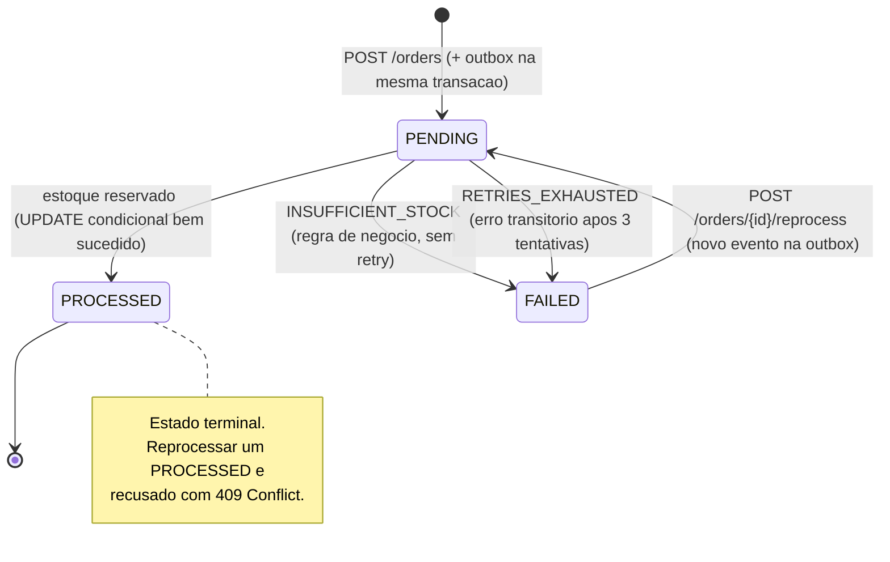
```mermaid
stateDiagram-v2
    [*] --> PENDING : POST /orders (+ outbox na mesma transacao)

    PENDING --> PROCESSED : estoque reservado (UPDATE condicional bem sucedido)
    PENDING --> FAILED : INSUFFICIENT_STOCK (regra de negocio, sem retry)
    PENDING --> FAILED : RETRIES_EXHAUSTED (erro transitorio apos 3 tentativas)

    FAILED --> PENDING : POST /orders/{id}/reprocess (novo evento na outbox)

    PROCESSED --> [*]
    note right of PROCESSED
        Estado terminal.
        Reprocessar um PROCESSED e
        recusado com 409 Conflict.
    end note
```

A transição `PENDING → PROCESSED` **nunca** é um `UPDATE` incondicional. É sempre
`UPDATE orders SET status='PROCESSED' WHERE id=? AND status='PENDING'`: se
`affectedRows = 0`, outro worker chegou antes e esta execução é uma reentrega —
encerra sem efeito, e sem erro.

### 7.2 OutboxMessage

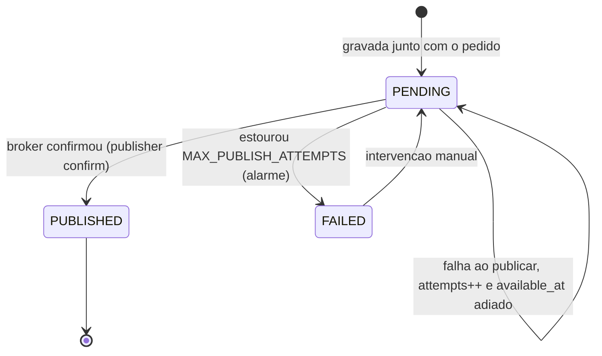
```mermaid
stateDiagram-v2
    [*] --> PENDING : gravada junto com o pedido
    PENDING --> PUBLISHED : broker confirmou (publisher confirm)
    PENDING --> PENDING : falha ao publicar, attempts++ e available_at adiado
    PENDING --> FAILED : estourou MAX_PUBLISH_ATTEMPTS (alarme)
    FAILED --> PENDING : intervencao manual
    PUBLISHED --> [*]
```

`PUBLISHED` significa **"o broker confirmou o recebimento"**, não "alguém consumiu".
Sem *publisher confirms*, `channel.publish()` retorna `true` só por ter escrito no
socket — marcar `PUBLISHED` nesse ponto é perder mensagem quando o broker cai no
meio.

---

## 8. Topologia RabbitMQ

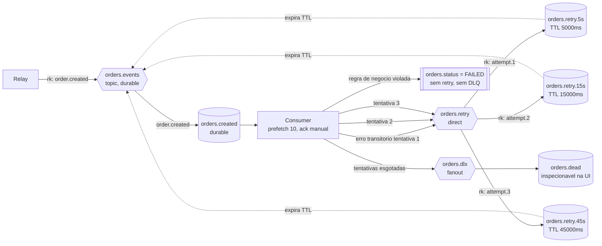
```mermaid
flowchart LR
    REL[Relay] -->|rk: order.created| EX{{"orders.events<br/>topic, durable"}}
    EX -->|order.created| Q[("orders.created<br/>durable")]
    Q --> CON["Consumer<br/>prefetch 10, ack manual"]

    CON -->|erro transitorio tentativa 1| RX{{"orders.retry<br/>direct"}}
    CON -->|tentativa 2| RX
    CON -->|tentativa 3| RX

    RX -->|rk: attempt.1| R1[("orders.retry.5s<br/>TTL 5000ms")]
    RX -->|rk: attempt.2| R2[("orders.retry.15s<br/>TTL 15000ms")]
    RX -->|rk: attempt.3| R3[("orders.retry.45s<br/>TTL 45000ms")]

    R1 -.expira TTL.-> EX
    R2 -.expira TTL.-> EX
    R3 -.expira TTL.-> EX

    CON -->|tentativas esgotadas| DX{{"orders.dlx<br/>fanout"}}
    DX --> DLQ[("orders.dead<br/>inspecionavel na UI")]

    CON -->|regra de negocio violada| FAIL[["orders.status = FAILED<br/>sem retry, sem DLQ"]]
```

| Recurso | Tipo | Argumentos | Papel |
|---|---|---|---|
| `orders.events` | topic, durable | — | ponto único de entrada dos eventos de pedido |
| `orders.created` | queue, durable | — | trabalho a fazer |
| `orders.retry` | direct, durable | — | roteia por número da tentativa |
| `orders.retry.5s` | queue, durable | `x-message-ttl=5000`, `x-dead-letter-exchange=orders.events`, `x-dead-letter-routing-key=order.created` | espera e devolve |
| `orders.retry.15s` | queue, durable | idem, TTL 15000 | espera e devolve |
| `orders.retry.45s` | queue, durable | idem, TTL 45000 | espera e devolve |
| `orders.dlx` | fanout, durable | — | destino final |
| `orders.dead` | queue, durable | — | inspeção humana |

**Por que três filas de espera em vez de uma.** O TTL no RabbitMQ é por fila, e o
broker só expira a mensagem **da cabeça** da fila. Com TTL por mensagem em uma fila
única, uma mensagem de 45 s na frente segura uma de 5 s atrás dela
(*head-of-line blocking*): o backoff vira uma mentira. Três filas com TTL fixo, uma
por tentativa, resolvem sem plugin externo. A alternativa seria o plugin
`rabbitmq_delayed_message_exchange`, descartada por exigir imagem customizada do
broker num teste que precisa subir com `docker compose up`.

**Por que o consumer republica em vez de dar `nack(requeue=false)`.** Com `nack` +
DLX, o destino é fixo por fila — não dá para escolher o tier de backoff em função da
tentativa. Republicando explicitamente, o consumer decide o atraso. O custo é que
publicar e dar ack são duas operações: publica-se **primeiro** (com confirm) e só
então se dá o ack. Um crash entre as duas gera reentrega — ou seja, duplicata — que é
exatamente o que a inbox e o `UNIQUE` de reserva existem para absorver. A ordem
inversa (ack antes de publicar) perderia a mensagem, o que nenhuma camada recupera.

---

## 9. Diagramas de sequência

### 9.1 Criação do pedido — o caminho síncrono (sem dual write)

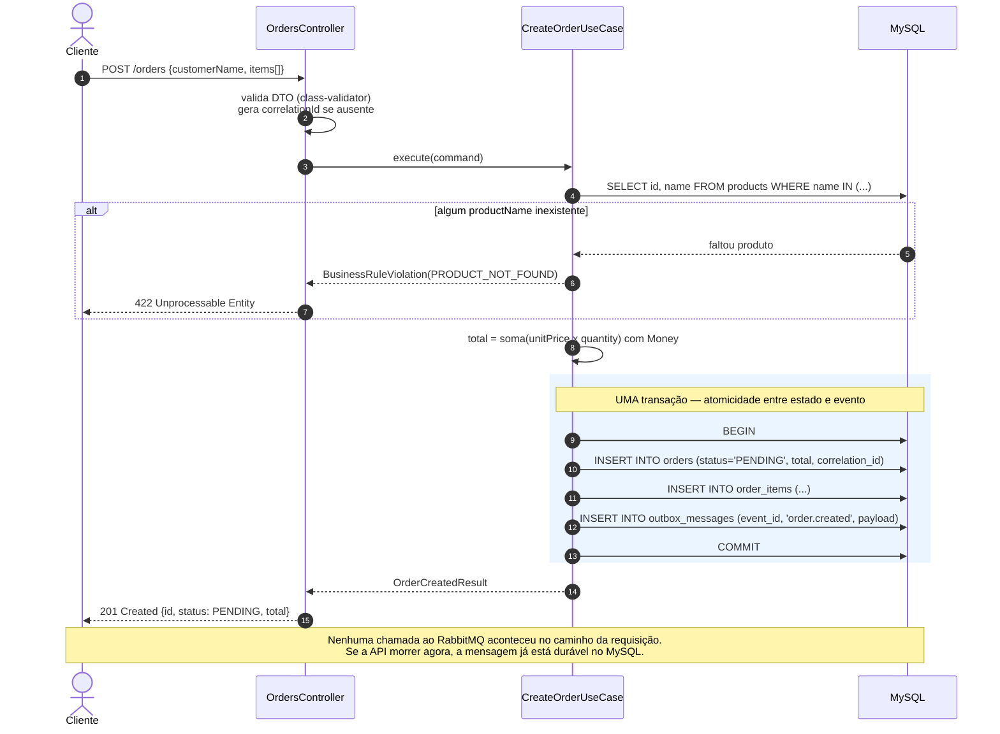
```mermaid
sequenceDiagram
    autonumber
    actor C as Cliente
    participant API as OrdersController
    participant UC as CreateOrderUseCase
    participant DB as MySQL

    C->>API: POST /orders {customerName, items[]}
    API->>API: valida DTO (class-validator)<br/>gera correlationId se ausente
    API->>UC: execute(command)

    UC->>DB: SELECT id, name FROM products WHERE name IN (...)
    alt algum productName inexistente
        DB-->>UC: faltou produto
        UC-->>API: BusinessRuleViolation(PRODUCT_NOT_FOUND)
        API-->>C: 422 Unprocessable Entity
    end

    UC->>UC: total = soma(unitPrice x quantity) com Money

    rect rgb(235, 245, 255)
        note over UC,DB: UMA transação — atomicidade entre estado e evento
        UC->>DB: BEGIN
        UC->>DB: INSERT INTO orders (status='PENDING', total, correlation_id)
        UC->>DB: INSERT INTO order_items (...)
        UC->>DB: INSERT INTO outbox_messages (event_id, 'order.created', payload)
        UC->>DB: COMMIT
    end

    UC-->>API: OrderCreatedResult
    API-->>C: 201 Created {id, status: PENDING, total}

    note over C,DB: Nenhuma chamada ao RabbitMQ aconteceu no caminho da requisição.<br/>Se a API morrer agora, a mensagem já está durável no MySQL.
```

### 9.2 Relay — da outbox para o broker

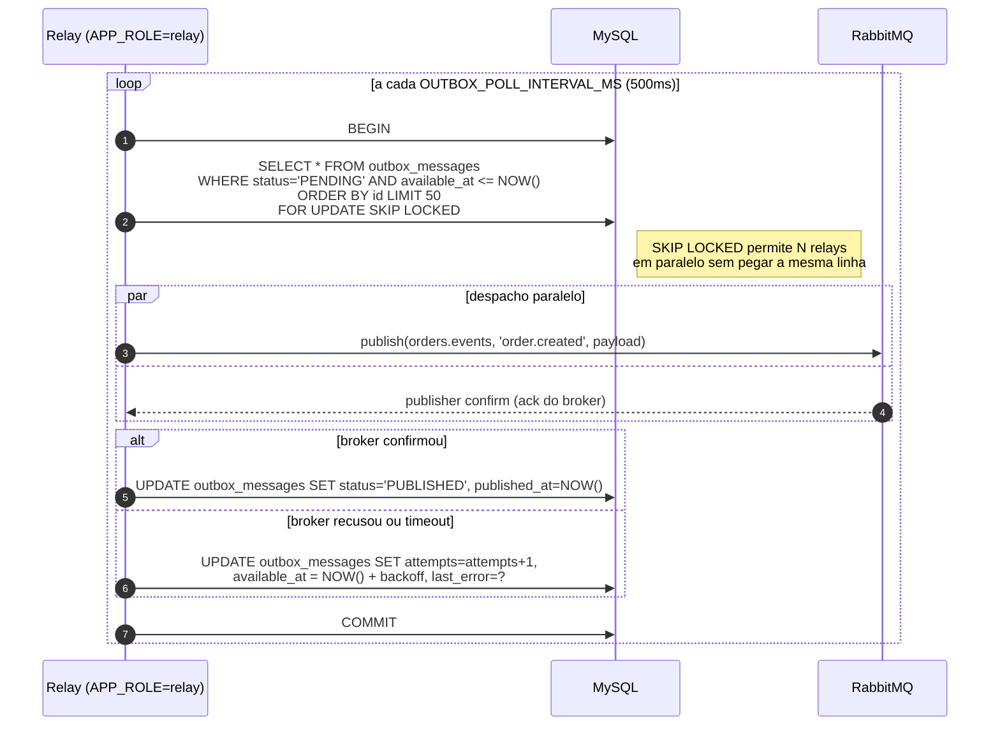
```mermaid
sequenceDiagram
    autonumber
    participant R as Relay (APP_ROLE=relay)
    participant DB as MySQL
    participant MQ as RabbitMQ

    loop a cada OUTBOX_POLL_INTERVAL_MS (500ms)
        R->>DB: BEGIN
        R->>DB: SELECT * FROM outbox_messages<br/>WHERE status='PENDING' AND available_at <= NOW()<br/>ORDER BY id LIMIT 50<br/>FOR UPDATE SKIP LOCKED
        note right of DB: SKIP LOCKED permite N relays<br/>em paralelo sem pegar a mesma linha

        par despacho paralelo
            R->>MQ: publish(orders.events, 'order.created', payload)
        and
            MQ-->>R: publisher confirm (ack do broker)
        end

        alt broker confirmou
            R->>DB: UPDATE outbox_messages SET status='PUBLISHED', published_at=NOW()
        else broker recusou ou timeout
            R->>DB: UPDATE outbox_messages SET attempts=attempts+1,<br/>available_at = NOW() + backoff, last_error=?
        end
        R->>DB: COMMIT
    end
```

**O detalhe que importa:** o `UPDATE` para `PUBLISHED` acontece **depois** do confirm
e **dentro** da mesma transação que segurou o lock. Se o processo morrer entre o
confirm e o commit, a linha volta a `PENDING` e será republicada — duplicata, não
perda. Essa é a escolha consciente de **at-least-once**, e é por isso que a
deduplicação existe do outro lado.

### 9.3 Processamento com sucesso — reserva de estoque

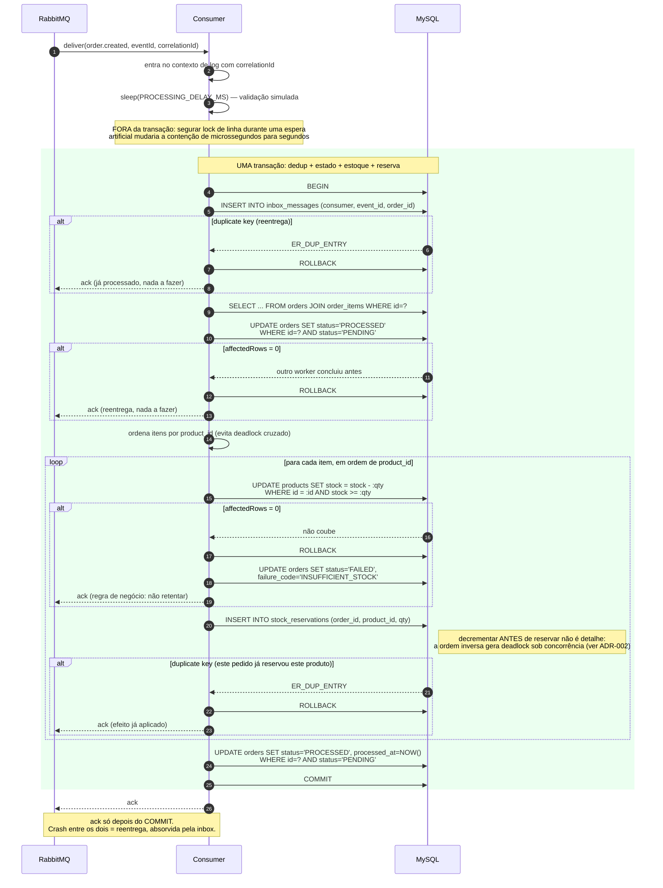
```mermaid
sequenceDiagram
    autonumber
    participant MQ as RabbitMQ
    participant W as Consumer
    participant DB as MySQL

    MQ->>W: deliver(order.created, eventId, correlationId)
    W->>W: entra no contexto de log com correlationId
    W->>W: sleep(PROCESSING_DELAY_MS) — validação simulada
    note over W: FORA da transação: segurar lock de linha durante uma espera<br/>artificial mudaria a contenção de microssegundos para segundos

    rect rgb(235, 255, 240)
        note over W,DB: UMA transação: dedup + estado + estoque + reserva
        W->>DB: BEGIN
        W->>DB: INSERT INTO inbox_messages (consumer, event_id, order_id)
        alt duplicate key (reentrega)
            DB-->>W: ER_DUP_ENTRY
            W->>DB: ROLLBACK
            W-->>MQ: ack (já processado, nada a fazer)
        end

        W->>DB: SELECT ... FROM orders JOIN order_items WHERE id=?
        W->>DB: UPDATE orders SET status='PROCESSED'<br/>WHERE id=? AND status='PENDING'
        alt affectedRows = 0
            DB-->>W: outro worker concluiu antes
            W->>DB: ROLLBACK
            W-->>MQ: ack (reentrega, nada a fazer)
        end
        W->>W: ordena itens por product_id (evita deadlock cruzado)

        loop para cada item, em ordem de product_id
            W->>DB: UPDATE products SET stock = stock - :qty<br/>WHERE id = :id AND stock >= :qty
            alt affectedRows = 0
                DB-->>W: não coube
                W->>DB: ROLLBACK
                W->>DB: UPDATE orders SET status='FAILED',<br/>failure_code='INSUFFICIENT_STOCK'
                W-->>MQ: ack (regra de negócio: não retentar)
            end
            W->>DB: INSERT INTO stock_reservations (order_id, product_id, qty)
            note right of DB: decrementar ANTES de reservar não é detalhe:<br/>a ordem inversa gera deadlock sob concorrência (ver ADR-002)
            alt duplicate key (este pedido já reservou este produto)
                DB-->>W: ER_DUP_ENTRY
                W->>DB: ROLLBACK
                W-->>MQ: ack (efeito já aplicado)
            end
        end

        W->>DB: UPDATE orders SET status='PROCESSED', processed_at=NOW()<br/>WHERE id=? AND status='PENDING'
        W->>DB: COMMIT
    end

    W-->>MQ: ack
    note over W,MQ: ack só depois do COMMIT.<br/>Crash entre os dois = reentrega, absorvida pela inbox.
```

### 9.4 Dois pedidos concorrentes no mesmo produto — o cenário obrigatório

Estoque inicial: **5 unidades**. Pedido A quer 3, pedido B quer 4. A soma (7) não cabe.

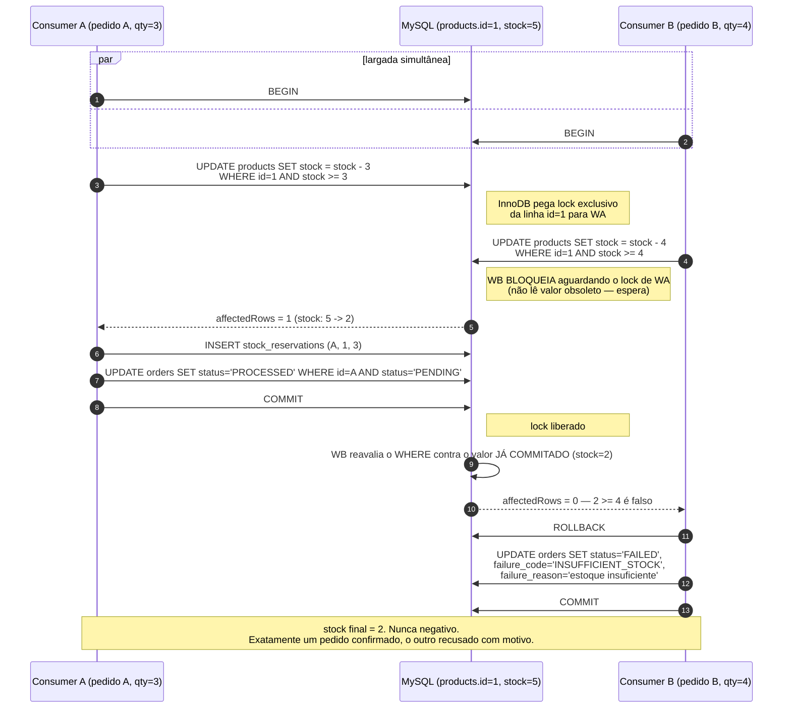
```mermaid
sequenceDiagram
    autonumber
    participant WA as Consumer A (pedido A, qty=3)
    participant DB as MySQL (products.id=1, stock=5)
    participant WB as Consumer B (pedido B, qty=4)

    par largada simultânea
        WA->>DB: BEGIN
    and
        WB->>DB: BEGIN
    end

    WA->>DB: UPDATE products SET stock = stock - 3<br/>WHERE id=1 AND stock >= 3
    note right of DB: InnoDB pega lock exclusivo<br/>da linha id=1 para WA

    WB->>DB: UPDATE products SET stock = stock - 4<br/>WHERE id=1 AND stock >= 4
    note right of DB: WB BLOQUEIA aguardando o lock de WA<br/>(não lê valor obsoleto — espera)

    DB-->>WA: affectedRows = 1 (stock: 5 -> 2)
    WA->>DB: INSERT stock_reservations (A, 1, 3)
    WA->>DB: UPDATE orders SET status='PROCESSED' WHERE id=A AND status='PENDING'
    WA->>DB: COMMIT
    note right of DB: lock liberado

    DB->>DB: WB reavalia o WHERE contra o valor JÁ COMMITADO (stock=2)
    DB-->>WB: affectedRows = 0 — 2 >= 4 é falso
    WB->>DB: ROLLBACK
    WB->>DB: UPDATE orders SET status='FAILED',<br/>failure_code='INSUFFICIENT_STOCK',<br/>failure_reason='estoque insuficiente'
    WB->>DB: COMMIT

    note over WA,WB: stock final = 2. Nunca negativo.<br/>Exatamente um pedido confirmado, o outro recusado com motivo.
```

**Por que isso funciona sem lock explícito.** Num `UPDATE ... WHERE`, o InnoDB
reavalia a condição do `WHERE` contra a versão **mais recente commitada** da linha
antes de aplicar a escrita, mesmo em `REPEATABLE READ` — é o comportamento de
*semi-consistent read* / *current read* de escritas. O segundo worker não enxerga o
`stock = 5` que leu antes; ele enxerga o `2` que o primeiro acabou de gravar. A
decisão "cabe ou não cabe" nunca sai do banco para a aplicação, e é por isso que não
existe janela de corrida entre o `SELECT` e o `UPDATE` — porque não existe `SELECT`.

### 9.5 Falha transitória — retentativa escalonada até a dead-letter

Disparada quando `customerName` contém `"fail"` (gatilho exigido pelo enunciado).

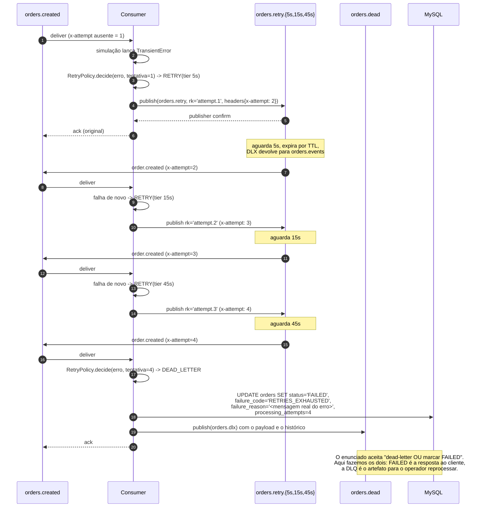
```mermaid
sequenceDiagram
    autonumber
    participant MQ as orders.created
    participant W as Consumer
    participant RQ as orders.retry.{5s,15s,45s}
    participant DLQ as orders.dead
    participant DB as MySQL

    MQ->>W: deliver (x-attempt ausente = 1)
    W->>W: simulação lança TransientError
    W->>W: RetryPolicy.decide(erro, tentativa=1) -> RETRY(tier 5s)
    W->>RQ: publish(orders.retry, rk='attempt.1', headers{x-attempt: 2})
    RQ-->>W: publisher confirm
    W-->>MQ: ack (original)
    Note over RQ: aguarda 5s, expira por TTL,<br/>DLX devolve para orders.events

    RQ->>MQ: order.created (x-attempt=2)
    MQ->>W: deliver
    W->>W: falha de novo -> RETRY(tier 15s)
    W->>RQ: publish rk='attempt.2' (x-attempt: 3)
    Note over RQ: aguarda 15s

    RQ->>MQ: order.created (x-attempt=3)
    MQ->>W: deliver
    W->>W: falha de novo -> RETRY(tier 45s)
    W->>RQ: publish rk='attempt.3' (x-attempt: 4)
    Note over RQ: aguarda 45s

    RQ->>MQ: order.created (x-attempt=4)
    MQ->>W: deliver
    W->>W: RetryPolicy.decide(erro, tentativa=4) -> DEAD_LETTER
    W->>DB: UPDATE orders SET status='FAILED',<br/>failure_code='RETRIES_EXHAUSTED',<br/>failure_reason='<mensagem real do erro>',<br/>processing_attempts=4
    W->>DLQ: publish(orders.dlx) com o payload e o histórico
    W-->>MQ: ack

    Note over DB,DLQ: O enunciado aceita "dead-letter OU marcar FAILED".<br/>Aqui fazemos os dois: FAILED é a resposta ao cliente,<br/>a DLQ é o artefato para o operador reprocessar.
```

### 9.6 Reentrega da mesma mensagem — idempotência

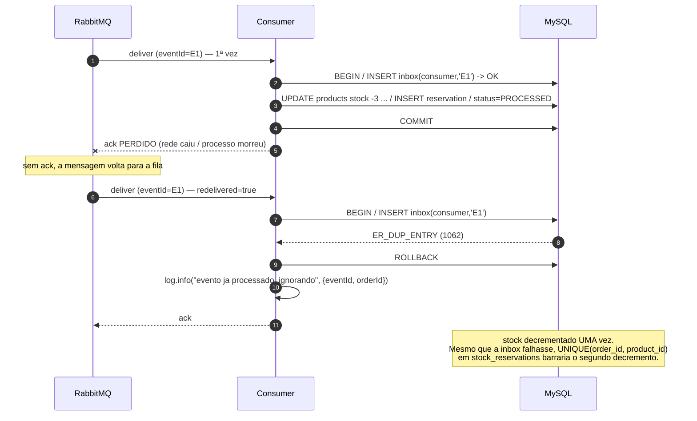
```mermaid
sequenceDiagram
    autonumber
    participant MQ as RabbitMQ
    participant W as Consumer
    participant DB as MySQL

    MQ->>W: deliver (eventId=E1) — 1ª vez
    W->>DB: BEGIN / INSERT inbox(consumer,'E1') -> OK
    W->>DB: UPDATE products stock -3 ... / INSERT reservation / status=PROCESSED
    W->>DB: COMMIT
    W--xMQ: ack PERDIDO (rede caiu / processo morreu)

    Note over MQ: sem ack, a mensagem volta para a fila

    MQ->>W: deliver (eventId=E1) — redelivered=true
    W->>DB: BEGIN / INSERT inbox(consumer,'E1')
    DB-->>W: ER_DUP_ENTRY (1062)
    W->>DB: ROLLBACK
    W->>W: log.info("evento ja processado, ignorando", {eventId, orderId})
    W-->>MQ: ack

    Note over DB: stock decrementado UMA vez.<br/>Mesmo que a inbox falhasse, UNIQUE(order_id, product_id)<br/>em stock_reservations barraria o segundo decremento.
```

### 9.7 Reprocessamento manual de um pedido FAILED

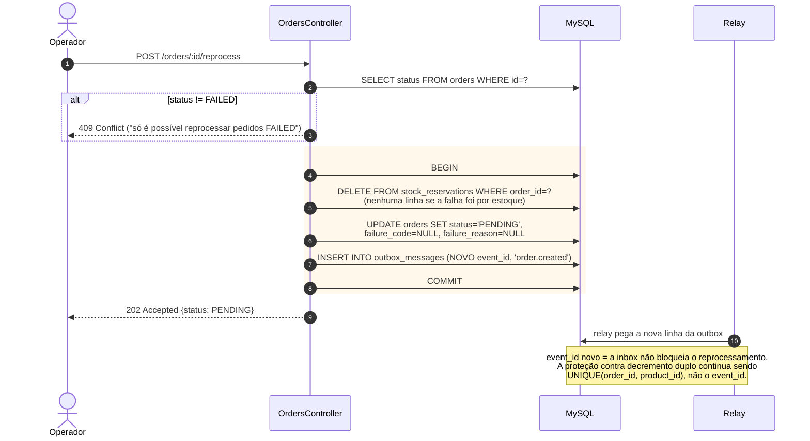
```mermaid
sequenceDiagram
    autonumber
    actor OP as Operador
    participant API as OrdersController
    participant DB as MySQL
    participant R as Relay

    OP->>API: POST /orders/:id/reprocess
    API->>DB: SELECT status FROM orders WHERE id=?

    alt status != FAILED
        API-->>OP: 409 Conflict ("só é possível reprocessar pedidos FAILED")
    end

    rect rgb(255, 248, 235)
        API->>DB: BEGIN
        API->>DB: DELETE FROM stock_reservations WHERE order_id=?<br/>(nenhuma linha se a falha foi por estoque)
        API->>DB: UPDATE orders SET status='PENDING',<br/>failure_code=NULL, failure_reason=NULL
        API->>DB: INSERT INTO outbox_messages (NOVO event_id, 'order.created')
        API->>DB: COMMIT
    end

    API-->>OP: 202 Accepted {status: PENDING}
    R->>DB: relay pega a nova linha da outbox
    Note over R,DB: event_id novo = a inbox não bloqueia o reprocessamento.<br/>A proteção contra decremento duplo continua sendo<br/>UNIQUE(order_id, product_id), não o event_id.
```

Este diagrama contém a sutileza mais fácil de errar do projeto: **reprocessar exige um
`event_id` novo**. Reusar o antigo faria a inbox classificar o reprocessamento como
duplicata e descartá-lo silenciosamente — o operador clicaria no botão e nada
aconteceria. Ao mesmo tempo, o `event_id` novo não reabre a porta para decremento
duplo, porque a defesa contra isso é a chave única da reserva, e não o identificador
do evento. As duas camadas de idempotência existem por razões diferentes, e esse caso
é a prova de que elas não são redundantes.

### 9.8 Crash do worker entre o COMMIT e o ack

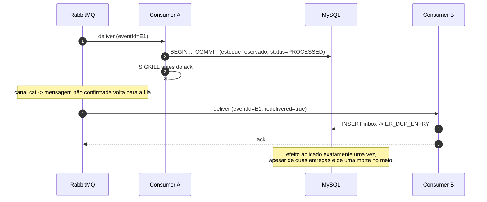
```mermaid
sequenceDiagram
    autonumber
    participant MQ as RabbitMQ
    participant W1 as Consumer A
    participant DB as MySQL
    participant W2 as Consumer B

    MQ->>W1: deliver (eventId=E1)
    W1->>DB: BEGIN ... COMMIT (estoque reservado, status=PROCESSED)
    W1-xW1: SIGKILL antes do ack
    Note over MQ: canal cai -> mensagem não confirmada volta para a fila

    MQ->>W2: deliver (eventId=E1, redelivered=true)
    W2->>DB: INSERT inbox -> ER_DUP_ENTRY
    W2-->>MQ: ack

    Note over DB: efeito aplicado exatamente uma vez,<br/>apesar de duas entregas e de uma morte no meio.
```

---

## 10. Decisões arquiteturais (ADRs)

Formato curto: **contexto → decisão → alternativas descartadas → custo aceito**.
São as decisões que eu defenderia numa conversa técnica, incluindo o que elas custam.

### ADR-001 — Transactional Outbox em vez de publicar direto no controller

**Contexto.** `POST /orders` precisa produzir dois efeitos em sistemas distintos:
uma linha no MySQL e uma mensagem no RabbitMQ. Não há transação distribuída entre eles.

**Decisão.** A API **nunca** fala com o broker. Ela grava o evento numa tabela
`outbox_messages` dentro da mesma transação do pedido. Um processo separado (relay)
lê e publica.

**Alternativas descartadas.**
- *Publicar depois do commit, no mesmo método.* É o dual write clássico: o commit
  passa, o `publish` falha (broker reiniciando, rede, deploy), e o pedido fica
  `PENDING` eternamente — sem erro para o cliente, porque o 201 já foi devolvido.
- *Publicar antes do commit.* Pior: o consumer pode receber `order.created` de um
  pedido cujo `INSERT` sofreu rollback, e passar a processar um id inexistente.
- *Two-phase commit / XA.* RabbitMQ não oferece XA de forma prática, e 2PC amarra a
  disponibilidade da API à do broker — exatamente o oposto do objetivo.
- *Change Data Capture (Debezium lendo o binlog).* É a evolução natural desta
  arquitetura em escala, e elimina o polling. Descartado aqui pelo custo operacional
  (Kafka Connect + Debezium num teste que precisa subir com um comando).

**Custo aceito.** Latência extra de até um ciclo de polling (500 ms) entre o 201 e a
mensagem chegar ao broker, e uma tabela a mais para operar. Em troca: se o RabbitMQ
estiver **completamente fora do ar**, a API continua aceitando pedidos normalmente, e
tudo é publicado quando ele voltar. Essa propriedade é a razão de ser da decisão.

### ADR-002 — Decremento condicional atômico como estratégia de concorrência

**Contexto.** O enunciado pede explicitamente uma estratégia para o cenário de dois
pedidos concorrentes no mesmo produto, e diz que não há uma única resposta certa.

**Decisão.** `UPDATE products SET stock = stock - :qty WHERE id = :id AND stock >= :qty`,
verificando `affectedRows`. Zero linhas afetadas significa "não coube".

**Alternativas descartadas.**

| Estratégia | Por que não |
|---|---|
| `SELECT ... FOR UPDATE` e decidir na aplicação | Funciona e é correta, mas segura o lock da linha por **toda** a transação, incluindo o `sleep` de processamento simulado. Sob produto quente, os workers serializam atrás do lock e o throughput cai para 1/(tempo de transação). |
| Lock otimista com coluna `version` | Correto, porém gera retry justamente onde há mais contenção. Num produto disputado, a taxa de conflito cresce com o paralelismo e o trabalho é refeito várias vezes. |
| `SERIALIZABLE` na transação inteira | Transfere o problema para o banco em forma de deadlocks e *lock wait timeouts* em consultas que nem tocam em estoque. |
| Reservar em Redis (`DECRBY` + `Lua`) | Rápido, mas cria uma segunda fonte de verdade para estoque, e a divergência entre Redis e MySQL depois de um crash é uma classe inteira de bug que não quero num teste. |

**Custo aceito.** A mensagem de erro não distingue "faltam 2 unidades" de "faltam 4":
o banco só devolve "não coube". Se o produto exigisse essa granularidade, um
`SELECT` extra **após** a falha (fora do caminho crítico) resolveria, e é assim que eu
faria em produção. Registrado como melhoria em vez de implementado, porque o custo é
uma consulta a mais em todo caminho de falha.

**Emenda, escrita depois de a suíte de concorrência reprovar a primeira versão.**
A ordem das duas operações dentro do item — decrementar o estoque e inserir a
reserva — não é arbitrária. A primeira implementação fazia o contrário (reservar
e depois decrementar), com o argumento de que a reentrega seria detectada antes de
qualquer efeito. Com dez pedidos simultâneos, o teste devolveu **30 deadlocks**.

O motivo: o `INSERT` em `stock_reservations` dispara a verificação da chave
estrangeira e adquire lock **compartilhado** na linha do produto. As dez
transações seguram o S e todas pedem o X do `UPDATE` logo depois; ninguém sobe de
S para X enquanto as outras seguram o S, e o InnoDB quebra o ciclo matando
transações. Decrementando primeiro, o `UPDATE` já adquire o X, o `INSERT` seguinte
pede o S de uma linha que esta mesma transação já travou, e as demais apenas
enfileiram.

O custo aceito é que a reentrega decrementa antes de descobrir, pela chave única,
que já havia reservado — e por isso a transação inteira é revertida, devolvendo o
estoque. Custo pago de bom grado: o efeito observável é idêntico e o deadlock
desaparece. Provado em `test/concurrency/deadlock-recovery.spec.ts`, 50 rodadas
com produtos em ordem oposta.

### ADR-003 — Reserva materializada com chave única para idempotência do efeito

**Contexto.** O enunciado é explícito: "um retry do mesmo pedido não pode decrementar
o estoque duas vezes".

**Decisão.** Toda reserva grava uma linha em `stock_reservations` com
`UNIQUE (order_id, product_id)`, na mesma transação do decremento. A segunda tentativa
viola a constraint e a transação inteira sofre rollback — inclusive o decremento.

**Por que não confiar só no status do pedido.** `IF status = 'PENDING' THEN decrementa`
é uma verificação *time-of-check to time-of-use*: dois workers podem ler `PENDING` ao
mesmo tempo. A constraint não tem essa janela, porque quem arbitra é o índice único.

**Custo aceito.** Uma tabela e um índice a mais. Em troca, a garantia deixa de depender
da corretude do código e passa a depender do banco — que é onde eu quero que ela
esteja. E ganha-se de graça a trilha de auditoria de qual pedido reservou o quê e quando.

### ADR-004 — Inbox persistente por consumidor

**Contexto.** Entrega AMQP é at-least-once. Ack perdido, canal derrubado, worker morto
depois do commit: todos produzem reentrega.

**Decisão.** `INSERT INTO inbox_messages (consumer, event_id)` como **primeira**
operação da mesma transação de negócio. Violação de chave = já processado.

**Alternativa descartada.** Deduplicar em memória (um `Set` de ids vistos): morre com o
processo, e não é compartilhado entre réplicas — ou seja, não funciona exatamente nos
dois cenários em que a deduplicação importa.

**Custo aceito.** A tabela cresce indefinidamente; o expurgo por idade
(`DELETE WHERE processed_at < NOW() - INTERVAL 30 DAY`) roda como rotina de
manutenção, fora do caminho crítico.

### ADR-005 — `SKIP LOCKED` no relay

**Contexto.** Com mais de uma réplica do relay, todas leriam as mesmas linhas
`PENDING` e publicariam a mesma mensagem N vezes.

**Decisão.** `SELECT ... FOR UPDATE SKIP LOCKED` (MySQL 8.0+): cada réplica pega um
lote disjunto; linhas já travadas por outra são simplesmente puladas.

**Custo aceito.** A ordem global de publicação deixa de ser garantida entre réplicas.
Aceitável porque `order.created` é independente por pedido — não há ordenação
semântica entre pedidos diferentes. Se houvesse (por exemplo, `order.created` seguido
de `order.cancelled`), seria necessário particionar por `aggregate_id`.

### ADR-006 — Erro de negócio e erro transitório são coisas diferentes

**Contexto.** Retentar "estoque insuficiente" três vezes com backoff é desperdiçar
65 segundos para chegar à mesma conclusão determinística.

**Decisão.** Duas famílias de erro no domínio: `BusinessRuleViolation` (determinístico
— falha agora e falharia de novo) e `TransientError` (deadlock, timeout, broker
indisponível — pode dar certo depois). A `RetryPolicy` decide com base no tipo:
negócio → `FAILED` imediato; transitório → retry escalonado; transitório esgotado →
`FAILED` + dead-letter.

**Custo aceito.** Classificar erro novo exige uma decisão consciente de quem escreve o
código. O default é o seguro: o que não for reconhecido é tratado como transitório e
vai para o fluxo de retry, então no pior caso desperdiça-se tempo — nunca se perde um
pedido.

### ADR-007 — Três papéis num binário só (`APP_ROLE`)

**Contexto.** API, relay e consumer têm perfis de escala e de falha diferentes, mas
compartilham domínio, entidades e repositórios.

**Decisão.** Um `src/main.ts` que lê `APP_ROLE` e inicializa apenas o módulo do papel.
Uma imagem Docker; três serviços no compose.

**Alternativas descartadas.** Três repositórios (triplica CI e duplica o domínio) ou um
processo único que faz tudo (impossível escalar consumer sem escalar API, e uma falha
no consumer derruba o HTTP).

**Custo aceito.** É um monólito modular, não microsserviços. A fronteira de extração já
está desenhada — é o preço certo para sete dias de prazo.

### ADR-008 — TypeORM com migrations versionadas, `synchronize: false`

**Contexto.** O schema tem *generated columns*, `CHECK` constraints e índices compostos
que nenhum sincronizador automático gera corretamente.

**Decisão.** TypeORM com `synchronize: false` sempre, inclusive em teste. Toda mudança
de schema é uma migration versionada, revisável em diff, e executada por um serviço
`migrate` que roda **antes** de qualquer papel subir
(`depends_on: condition: service_completed_successfully`).

**Por que TypeORM e não Prisma.** Duas razões concretas: o `QueryRunner` do TypeORM
expõe a transação como objeto explícito, que é o que permite passar a **mesma**
transação para três repositórios diferentes (`UnitOfWork`); e `SELECT ... FOR UPDATE
SKIP LOCKED` é primeira classe no query builder, enquanto no Prisma exigiria
`$queryRaw` — o que anularia boa parte do ganho de tipagem.

**Custo aceito.** O TypeORM devolve `DECIMAL` como `string`. Em vez de lutar contra
isso, é o comportamento desejado: a `string` vai direto para o construtor de `Money`,
sem passar por `number` em momento algum.

### ADR-009 — RabbitMQ com amqplib cru, sem `@nestjs/microservices`

**Contexto.** É preciso controlar topologia (três filas de retry com TTL e DLX),
`prefetch`, ack manual e *publisher confirms*.

**Decisão.** `amqplib` atrás de uma porta `EventPublisher` do domínio, com a topologia
declarada em um único arquivo idempotente (`assertExchange`/`assertQueue` na subida).

**Alternativa descartada.** `@nestjs/microservices` com transporte RMQ: esconde o canal,
não expõe confirms de forma prática, e a topologia de retry escalonado teria de ser
criada fora dele de qualquer maneira — sobrando a abstração sem o benefício.

**Custo aceito.** Mais código de infraestrutura (reconexão, heartbeat, shutdown). Fica
todo confinado em `infrastructure/messaging`, e o domínio nunca vê `amqplib`.

### ADR-010 — Paginação por `page`/`limit` (offset), com o custo declarado

**Contexto.** O enunciado pede "paginação simples (`page`, `limit`)".

**Decisão.** Entregar exatamente isso: `LIMIT :limit OFFSET :offset`, com `limit`
limitado a 100 e o total devolvido em `meta`.

**Custo aceito, e por que declaro.** `OFFSET` degrada linearmente: a página 10.000 faz o
MySQL ler e descartar 200.000 linhas. Para um catálogo de pedidos em produção, o certo
é paginação por cursor (`WHERE (created_at, id) < (:lastCreatedAt, :lastId)`), que é
O(log n) constante em qualquer página — e é justamente por isso que
`ix_orders_created_at` é `(created_at, id)` e não só `(created_at)`: o índice já está
pronto para a migração do cursor. Implementei o que foi pedido, deixei o caminho aberto.

### ADR-011 — UUIDv7 gerado na aplicação, não no banco

**Contexto.** O `id` do pedido precisa existir **antes** do `INSERT`, porque o payload
do evento da outbox (gravado na mesma transação) já o referencia.

**Decisão.** UUIDv7 gerado em memória pelo caso de uso.

**Alternativa descartada.** `AUTO_INCREMENT` + `LAST_INSERT_ID()`: força uma ida a mais
ao banco e uma ordem de escrita rígida dentro da transação, e expõe o volume de
negócio na URL.

**Custo aceito.** 36 bytes contra 8 na chave primária. Mitigado por ser v7 (prefixo
temporal preserva a localidade do índice clusterizado) e por `products` — a tabela
referenciada por três FKs — continuar com `BIGINT`.

### ADR-012 — Fronteiras entre camadas verificadas no lint

**Contexto.** O enunciado diz: "não vale chamar a lógica de processamento diretamente
dentro do controller". Isso é uma propriedade estrutural, e propriedades estruturais
sobrevivem melhor quando são verificadas por máquina.

**Decisão.** `eslint-plugin-boundaries` com política explícita: `domain` não importa
nada; `application` importa só `domain`; `interface` e `workers` não importam de
`infrastructure/messaging` diretamente; ninguém importa de `interface`.

**Custo aceito.** Configuração inicial e algum atrito quando uma dependência nova
precisa de uma porta. Esse atrito é o ponto.

### ADR-013 — Testes contra infraestrutura real, não contra mocks

**Contexto.** O enunciado é direto: "não vale só testar o caminho feliz mockando tudo".

**Decisão.** Três níveis. Unitário sem I/O (total, `RetryPolicy`, `Money`). Integração
contra MySQL e RabbitMQ **reais**, num `docker-compose.test.yml` em portas dedicadas
(33307 e 5673) para nunca colidir com o ambiente de dev. Concorrência com paralelismo
real e barreira de largada.

**Por que não `sqlite` nem mock de repositório na integração.** O comportamento que
estou testando — `affectedRows = 0` num `UPDATE` condicional sob lock concorrente do
InnoDB — **só existe no MySQL**. Um teste com repositório mockado passaria com o bug
de overselling presente, o que o tornaria pior que nenhum teste.

**Custo aceito.** A suíte de integração leva dezenas de segundos e exige Docker.

### ADR-014 — Preço vem do payload, com a divergência registrada

**Contexto.** O enunciado manda receber `price` em cada item do `POST /orders`.

**Decisão.** Obedecer: `unit_price` guarda o preço enviado pelo cliente, e o total é
calculado sobre ele.

**Evolução natural.** Com o contrato livre, o preço viria de `products.price` no
momento da criação e o campo do payload passaria a ser um "preço esperado", usado
para detectar catálogo desatualizado e devolver `409 Conflict` na divergência. O
`OrderItem` já guarda `unitPrice` como `Money`, então a troca é de uma linha no
caso de uso — o contrato pedido pelo enunciado é respeitado sem fechar a porta.

---

### ADR-015 — Fronteiras de arquitetura também como teste, não só como lint

**Contexto.** O ADR-012 põe a política de camadas no `eslint-plugin-boundaries`.
Isso resolve o import direto e proibido. Não resolve três coisas: o caminho
**transitivo** (`controller → helper → publisher`), a **ausência** de um arquivo
que a arquitetura promete, e o **ciclo** de importação.

**Decisão.** Uma suíte em `test/architecture/` que lê o grafo de importação de
`src/` e falha apontando o arquivo culpado. Sem dependência nova, sem *type
checker*: leitura de texto, ~1,5 s, roda junto com os unitários e antes de
qualquer serviço subir no CI.

Ela verifica também invariantes que não são de fronteira mas têm o mesmo caráter
— `synchronize: true`, dinheiro tipado como `number`, `process.env` fora do
config, SQL fora de `persistence`, `.only` esquecido num teste — e a integridade
da própria suíte: todo arquivo de domínio ou aplicação com comportamento tem um
`.spec.ts`, e todo requisito do enunciado tem pelo menos um cenário BDD.

**Por que não `dependency-cruiser` ou `ts-arch`.** Ambos resolveriam a parte de
grafo, e nenhum dos dois resolve a metade que me interessa mais aqui — a
integridade da matriz de testes contra o que existe em disco. Uma dependência a
menos e as regras ficam num arquivo que qualquer pessoa do time lê e edita.

**Custo aceito.** Regras de texto têm falso positivo possível (uma string com a
palavra `SELECT` num comentário, por exemplo). Quando acontecer, a correção é
explicitar a exceção na tabela do próprio arquivo — o atrito é o ponto, porque
afrouxar fronteira é decisão de arquitetura, não detalhe de implementação.

### ADR-016 — Especificação executável em Gherkin como camada de aceitação

**Contexto.** O enunciado descreve o cenário mais difícil — dois pedidos
concorrentes no mesmo produto — em prosa, e diz que quer ver *qual estratégia eu
escolho e como justifico*. Avaliação disso acontece lendo, não rodando.

**Decisão.** Os comportamentos esperados viram `.feature` em português
(`# language: pt`), escritos **antes** do código, ligados ao Jest por
`jest-cucumber`. O `.feature` é o contrato legível; o step definition é a
implementação; a user story em `USER_STORIES.md` é a origem.

**Um cenário, um dono.** A separação é por arquivo, não por filtro: um `.feature`
inteiro pertence a uma suíte. `estoque-reserva.feature` roda pelos step
definitions; `estoque-concorrencia.feature` roda por `test/concurrency/`, porque
seus cenários precisam de barreira de largada, pool dimensionado e repetição.
Não há `tagFilter` — filtro por tag funciona, mas é convenção invisível: quem abre
o arquivo não vê que metade dele não roda ali.

**Custo aceito.** Uma camada a mais entre a intenção e o código, e o risco clássico
de step definition virar prosa sem valor. A defesa é a regra da §15: todo cenário
tem uma asserção que falharia se o bug existisse — cenário que só verifica status
200 não entra.


### ADR-017 — Duas portas de identidade, e a integração com Keycloak como prova

**Contexto.** O enunciado permite descrever a integração com SSO em vez de
implementá-la. Descrever é barato — e é exatamente por isso que uma afirmação
como "trocar de provedor substitui duas classes" costuma ser falsa: ninguém
testou.

**Decisão.** Modelar identidade como duas portas do domínio — `TokenVerifier`
(quem é o portador deste token) e `CredentialsAuthenticator` (troque credenciais
por token) — e implementar os **dois** adaptadores: local (HS256 sobre a tabela
`users`) e Keycloak (RS256 contra o JWKS). `AUTH_PROVIDER` escolhe na subida.

**O que isso comprou.** A afirmação deixou de ser promessa: a integração
acrescentou duas classes e três linhas de seleção, e `src/domain/` e
`src/application/` ficaram intactos. Quando eu digo que a troca é local, existe
um commit provando.

**Custo aceito.** Dois caminhos de autenticação para manter, e um container a
mais no `docker-compose.test.yml` para que a suíte de SSO rode contra um Keycloak
de verdade. Em troca, o caminho padrão continua subindo instantâneo — quem só
quer rodar o sistema não paga os ~30 s do Keycloak.

**Por que não manter só o Keycloak.** Porque aí toda a suíte de testes passaria a
depender dele, e os 295 testes que rodam sem Docker deixariam de rodar sem Docker.

### ADR-018 — TypeORM usado como ORM, com SQL só onde o SQL é o artefato

**Contexto.** Durante boa parte da implementação, o acesso a dados era `SQL`
cru via `runner.query()`. Funcionava, o SQL ficava visível, e havia uma
justificativa plausível: o decremento condicional é a peça mais delicada do
sistema e merece estar à vista.

A medição desmontou o argumento. Eram **30 queries cruas, zero `QueryBuilder`,
zero API de repositório e `entities: []`** — a justificativa valia para duas
instruções e estava sendo usada para cobrir as outras vinte e oito. Na prática o
TypeORM era pool de conexão, controle de transação e executor de migration.

**Decisão.** Mapear as sete tabelas com `EntitySchema`, usar `getRepository`
para o acesso comum e `createQueryBuilder` para o condicional. O SQL gerado é o
mesmo — inclusive nas duas instruções críticas:

| O que | Como fica | SQL gerado |
|---|---|---|
| Decremento atômico | `.update(ProductEntity).set({ stock: () => 'stock - :qty' }).where('id = :id AND stock >= :qty')` | `UPDATE products SET stock = stock - ? WHERE id = ? AND stock >= ?` |
| Reserva do relay | `.setLock('pessimistic_write').setOnLocked('skip_locked')` | `... FOR UPDATE SKIP LOCKED` |

**Por que a apresentação é vertical por recurso.** O `interface/http/` já foi
uma pasta de 16 arquivos: DTO, controller, guard, decorator, filter e presenter
no mesmo nível. Duas referências apontam na mesma direção — a documentação do
NestJS põe os DTOs em `dto/` dentro da feature e os guards/filters num `common/`,
e o template de Clean Architecture do Ardalis organiza a camada de apresentação
por recurso (`Endpoints/Order/`, `Endpoints/Cart/`). Aqui cada recurso é uma
pasta com o controller, o `dto/` dele e o presenter; o que serve a todos vive em
`common/`. Uma regra de arquitetura mantém a raiz de cada fatia de adaptador
reservada a composição, e outra exige **um DTO por arquivo** — foi um arquivo
chamado `order-response.dto.ts` guardando nove classes, incluindo as de login e
de health check, que motivou a regra.

**Por que o Swagger saiu do controller.** O `orders.controller.ts` tinha 189
linhas, das quais ~140 eram `@ApiOperation`, `@ApiBody` e exemplos de payload. A
documentação virou decorators compostos em `docs/orders.api-docs.ts`
(`DocumentaCriacaoDePedido()` e companhia) e o controller caiu para 76 linhas,
lendo como roteamento. O `/docs-json` é byte a byte o mesmo: mesmas respostas,
mesmos quatro exemplos.

**Por que `EntitySchema` e não decorators.** Decorator de ORM numa entidade de
domínio faria `src/domain/` importar `typeorm`, e o teste de fronteiras recusa.
`Order`, `Product` e `Money` continuam classes puras; o mapeamento mora num
`.entity-schema.ts` dentro da pasta do agregado — `order/order.entity-schema.ts`
ao lado de `order/order.repository.ts` — e `persistence/entities.ts` só junta os
schemas para a datasource. Uma regra de arquitetura impede que um schema seja
importado de fora da pasta dele: quem está fora fala com o repositório.

**O que o mapeamento comprou além da tipagem.** O `moneyTransformer` deixou de
ser opcional: dinheiro vira `Money` na leitura porque o mapeamento faz isso, e
não porque cada repositório lembrou de chamar `Money.of`. Antes, esquecer uma
chamada devolvia string; agora não há caminho para esquecer.

**Onde o SQL cru continua, e por quê.** Em dois lugares, os dois verificados
pelo teste de arquitetura: **migrations** (lá o SQL *é* o artefato entregue) e a
**sonda de readiness** (`SELECT 1` é um ping de conexão, não leitura de dado).
Qualquer `.query(` num repositório quebra o CI.

**O que eu deliberadamente NÃO usei.** `orIgnore()` na reserva de estoque. Ele
geraria `INSERT IGNORE`, que no MySQL rebaixa vários erros a aviso — uma
violação de chave estrangeira viraria silenciosamente "já reservado" e o pedido
seria confirmado sem reserva. O `try/catch` em `ER_DUP_ENTRY` captura
exatamente o caso previsto e deixa todo o resto subir. Tem teste contra o banco
real para os dois lados.

## 11. Concorrência

### 11.1 Unidade de contenção

A única linha disputada no sistema inteiro é **`products.id`**. Pedidos concorrentes
de produtos diferentes não se tocam; pedidos do mesmo produto serializam por um
intervalo da ordem de microssegundos — o tempo do `UPDATE`, não o tempo da transação
inteira, porque não há `SELECT ... FOR UPDATE` segurando a linha durante o `sleep`
de processamento.

### 11.2 Matriz de proteção

| Corrida | Quem pode causar | Proteção | Camada |
|---|---|---|---|
| Dois pedidos decrementam além do estoque | 2+ consumers em paralelo | `UPDATE ... WHERE stock >= :qty` | MySQL |
| Estoque fica negativo por bug futuro | código novo sem a cláusula | `CHECK (stock >= 0)` | MySQL |
| Mesmo pedido decrementa duas vezes | reentrega da fila | `UNIQUE (order_id, product_id)` | MySQL |
| Mesmo evento processado duas vezes | ack perdido, crash pós-commit | `PRIMARY KEY (consumer, event_id)` | MySQL |
| Pedido marcado `PROCESSED` duas vezes | duas entregas simultâneas | `UPDATE ... WHERE status='PENDING'` (checa `affectedRows`) | MySQL |
| Mesma mensagem publicada por 2 relays | escala horizontal do relay | `FOR UPDATE SKIP LOCKED` | MySQL |
| Deadlock entre itens do mesmo pedido | pedidos com produtos {A,B} e {B,A} | ordenação por `product_id` antes do loop de `UPDATE` | aplicação |
| Reprocessamento duplicado pelo operador | dois cliques no botão | `UPDATE ... WHERE status='FAILED'` (checa `affectedRows`) | MySQL |

Sete das oito proteções são do banco. Isso é deliberado: o MySQL é o único componente
que enxerga todas as instâncias ao mesmo tempo. Qualquer garantia implementada em
memória na aplicação vale apenas para um processo — e o cenário do enunciado é
exatamente o de vários processos.

### 11.3 Prevenção de deadlock

Dois pedidos com os mesmos produtos em ordens opostas produzem o deadlock clássico:

```text
Pedido A: UPDATE produto 1 -> UPDATE produto 2
Pedido B: UPDATE produto 2 -> UPDATE produto 1     <- deadlock
```

O InnoDB detecta e mata uma das transações com `ER_LOCK_DEADLOCK` (1213). Duas
defesas, nesta ordem:

1. **Evitar:** ordenar os itens por `product_id` crescente antes do loop de `UPDATE`.
   Com ordem global consistente, o ciclo de espera não se forma.
2. **Absorver:** `ER_LOCK_DEADLOCK` e `ER_LOCK_WAIT_TIMEOUT` são classificados como
   `TransientError` — a mensagem volta pela fila de retry e tenta de novo. Deadlock é
   um evento esperado num banco sob concorrência, não um bug.

### 11.4 O cenário obrigatório, como teste executável

`test/concurrency/oversell.spec.ts`:

1. Produto com `stock = 5`.
2. Dez pedidos de 1 unidade cada, todos `PENDING`.
3. Dez chamadas ao `ProcessOrderUseCase` disparadas com **barreira de largada**
   (`Promise.all` sobre promessas que só resolvem depois que todas estão prontas),
   com pool de conexões dimensionado para que sejam de fato simultâneas.
4. Asserções:
   - `stock` final **exatamente** `0` — nunca negativo;
   - **exatamente 5** pedidos `PROCESSED`;
   - **exatamente 5** pedidos `FAILED` com `failure_code = 'INSUFFICIENT_STOCK'`;
   - `SUM(stock_reservations.quantity) = 5`;
   - `COUNT(stock_reservations) = 5` (nenhuma reserva órfã de pedido que falhou).

A quinta asserção é a que pega o bug sutil: um código que decremente o estoque e só
depois falhe em outro item deixaria reserva órfã, e o estoque "sumiria" sem pedido
correspondente.

---

## 12. Idempotência

Três camadas independentes, cada uma respondendo a uma pergunta diferente. Elas não
são redundantes — a seção 9.7 mostra um caso em que uma deve deixar passar e a outra
deve barrar.

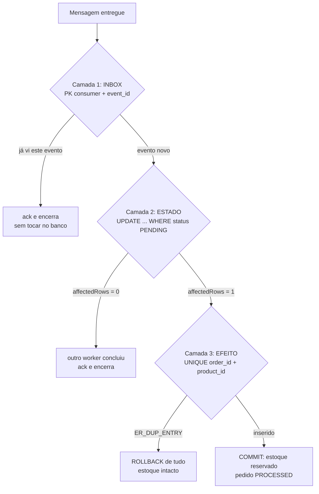
```mermaid
flowchart TD
    M["Mensagem entregue"] --> L1{"Camada 1: INBOX<br/>PK consumer + event_id"}
    L1 -->|já vi este evento| SKIP["ack e encerra<br/>sem tocar no banco"]
    L1 -->|evento novo| L2{"Camada 2: ESTADO<br/>UPDATE ... WHERE status PENDING"}
    L2 -->|affectedRows = 0| SKIP2["outro worker concluiu<br/>ack e encerra"]
    L2 -->|affectedRows = 1| L3{"Camada 3: EFEITO<br/>UNIQUE order_id + product_id"}
    L3 -->|ER_DUP_ENTRY| RB["ROLLBACK de tudo<br/>estoque intacto"]
    L3 -->|inserido| OK["COMMIT: estoque reservado<br/>pedido PROCESSED"]
```

| Camada | Pergunta | Mecanismo | Escopo |
|---|---|---|---|
| 1 — mensagem | "já processei **esta entrega**?" | `inbox_messages (consumer, event_id)` | por consumidor |
| 2 — estado | "este pedido ainda está esperando?" | `UPDATE ... WHERE status='PENDING'` | por pedido |
| 3 — efeito | "este pedido já reservou **este produto**?" | `UNIQUE (order_id, product_id)` | por par pedido/produto |

**A camada 3 é a que não pode faltar.** As camadas 1 e 2 dependem de o código chamá-las
na ordem certa. A 3 é uma constraint: vale mesmo para código escrito daqui a seis
meses por outra pessoa, que esqueceu que a inbox existe. O reprocessamento manual
(seção 9.7) atravessa 1 e 2 de propósito — gera `event_id` novo e devolve o status
para `PENDING` — e ainda assim não consegue decrementar duas vezes, porque a 3 não
depende de nenhuma das duas.

---

## 13. Mensageria: classificação de erro e parâmetros

### 13.1 Como o consumidor classifica um erro

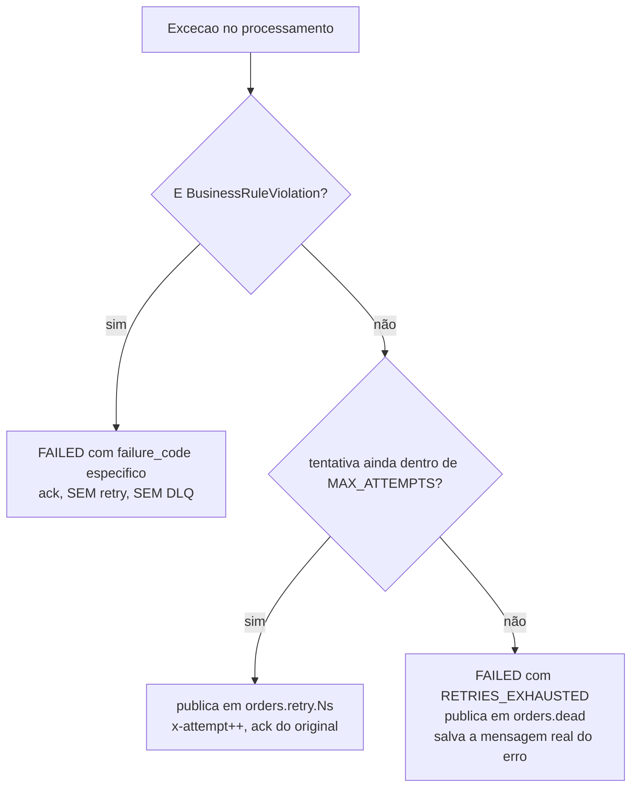
```mermaid
flowchart TD
    E["Excecao no processamento"] --> Q1{"E BusinessRuleViolation?"}
    Q1 -->|sim| B["FAILED com failure_code especifico<br/>ack, SEM retry, SEM DLQ"]
    Q1 -->|não| Q2{"tentativa ainda dentro de MAX_ATTEMPTS?"}
    Q2 -->|sim| R["publica em orders.retry.Ns<br/>x-attempt++, ack do original"]
    Q2 -->|não| D["FAILED com RETRIES_EXHAUSTED<br/>publica em orders.dead<br/>salva a mensagem real do erro"]
```

| Erro | Classe | Ação |
|---|---|---|
| Estoque insuficiente | `BusinessRuleViolation` | `FAILED: INSUFFICIENT_STOCK` — "estoque insuficiente" |
| Produto inexistente na reserva | *impossível* | A FK `fk_order_items_product` com `ON DELETE RESTRICT` impede que um produto referenciado por um pedido desapareça. Esta linha já descreveu um caminho que o schema torna inalcançável; ficou aqui, corrigida, porque a razão vale mais que a ausência |
| Pedido não existe no banco | `BusinessRuleViolation` | `FAILED` não é possível (não há linha) → DLQ direto + log de erro |
| `customerName` contém "fail" | `TransientError` (simulado) | retry escalonado → DLQ + `RETRIES_EXHAUSTED` |
| Deadlock InnoDB (1213) | `TransientError` | retry |
| Lock wait timeout (1205) | `TransientError` | retry |
| Conexão MySQL caiu | `TransientError` | retry |
| JSON de payload corrompido | `BusinessRuleViolation` | DLQ direto (retentar não conserta byte quebrado) |
| Qualquer outra exceção | tratada como `TransientError` | retry — o default é o seguro |

A escolha de fazer o gatilho `"fail"` ser **transitório** é proposital: é o único
caminho que exercita a máquina de retry completa de ponta a ponta (três tentativas,
três TTLs, dead-letter, `failure_reason` gravado). Se fosse classificado como erro de
negócio, o requisito 5 do enunciado — "trate isso com retry e, após esgotar as
tentativas, mova para dead-letter" — ficaria sem prova executável.

### 13.2 Parâmetros, e por que estes valores

| Parâmetro | Valor | Racional |
|---|---|---|
| `prefetch` | 10 | Mensagens em voo por consumer. Alto demais e um consumer acumula trabalho enquanto outro fica ocioso; baixo demais e o round-trip do ack vira o gargalo. |
| Retentativas | 3 | Cobre falha transitória de infraestrutura (restart de broker, failover de banco) sem segurar uma mensagem envenenada por minutos. São **4 tentativas de processamento** ao todo: a primeira mais três retentativas. |
| Backoff | 5s → 15s → 45s | Fator 3. Um degrau por retentativa; 65 s no total: tempo suficiente para um restart de container, curto o bastante para o operador não esperar. Na suíte os degraus são curtos por configuração (`RETRY_TIERS_MS`) — o que se prova é a mecânica, não a duração. |
| `OUTBOX_POLL_INTERVAL_MS` | 500 | Limite superior da latência entre o 201 e a mensagem no broker. |
| `OUTBOX_BATCH_SIZE` | 50 | Lote por ciclo do relay. |
| `PROCESSING_DELAY_MS` | 1500 | O `sleep` de 1–2 s pedido pelo enunciado, representando a validação de estoque. |
| `heartbeat` AMQP | 15 s | Detecta conexão morta antes de o TCP perceber. |
| Shutdown | `SIGTERM` → `channel.cancel()` → drena em voo → fecha | Nenhuma mensagem é perdida em deploy. |

---

## 14. Observabilidade

### 14.1 Correlation ID de ponta a ponta

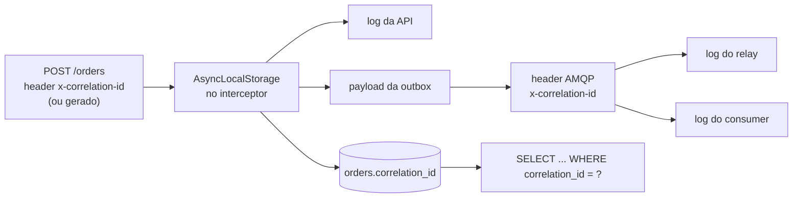
```mermaid
flowchart LR
    REQ["POST /orders<br/>header x-correlation-id<br/>(ou gerado)"] --> ALS["AsyncLocalStorage<br/>no interceptor"]
    ALS --> LOG1[log da API]
    ALS --> COL[(orders.correlation_id)]
    ALS --> PAY[payload da outbox]
    PAY --> HDR["header AMQP<br/>x-correlation-id"]
    HDR --> LOG2[log do relay]
    HDR --> LOG3[log do consumer]
    COL --> INV["SELECT ... WHERE correlation_id = ?"]
```

Toda linha de log é JSON e carrega no mínimo `correlationId`, `role`
(`api`/`relay`/`consumer`), `orderId` quando aplicável e `eventId` no consumer. O
mesmo identificador aparece nos três processos e numa coluna indexada do banco — é o
que transforma "investigar" em uma consulta em vez de uma arqueologia.

### 14.2 Investigando na prática: "o pedido X está PENDING há 10 minutos"

O roteiro que responde a pergunta 5 do enunciado, em quatro consultas:

```sql
-- 1. O pedido existe e em que estado está?
SELECT id, status, failure_code, failure_reason, processing_attempts,
       correlation_id, created_at, processed_at
FROM orders WHERE id = :orderId;
```

```sql
-- 2. O evento chegou a ser publicado? Separa "problema na API" de "problema na fila".
SELECT id, event_id, status, attempts, last_error, created_at, published_at
FROM outbox_messages WHERE aggregate_id = :orderId;
```

| O que a consulta 2 mostra | Diagnóstico | Onde olhar |
|---|---|---|
| Nenhuma linha | O pedido foi gravado sem evento — **bug na atomicidade**, o mais grave possível | `CreateOrderUseCase`: alguma escrita saiu da transação |
| `status = 'PENDING'`, `attempts = 0` | O relay não passou por aqui | relay caiu, ou `docker compose ps relay` |
| `status = 'PENDING'`, `attempts > 0`, `last_error` preenchido | O relay tentou e o broker recusou | broker fora do ar ou disco cheio |
| `status = 'PUBLISHED'` | Saiu da API, o problema está adiante | consulta 3 |

```sql
-- 3. O consumidor chegou a receber?
SELECT * FROM inbox_messages WHERE order_id = :orderId;
```

- **Sem linha** → a mensagem está parada no broker. `rabbitmqctl list_queues name
  messages messages_ready messages_unacknowledged`: se `orders.created` tem backlog,
  faltam consumers (escalar); se `orders.retry.*` tem mensagens, está em backoff;
  se `orders.dead` tem, esgotou as tentativas e o `UPDATE` de `FAILED` é que falhou.
- **Com linha, mas pedido `PENDING`** → o consumidor processou e não concluiu a
  transição: buscar o `correlationId` nos logs do consumer.

```bash
# 4. A linha do tempo completa, nos três processos
docker compose logs api relay consumer | grep '"correlationId":"<id>"' | jq .
```

### 14.3 Sinais que mereceriam alarme em produção

| Sinal | Consulta | O que significa |
|---|---|---|
| Outbox envelhecendo | `SELECT COUNT(*) FROM outbox_messages WHERE status='PENDING' AND created_at < NOW() - INTERVAL 1 MINUTE` | Relay parado ou broker fora |
| Pedidos presos | `SELECT COUNT(*) FROM orders WHERE status='PENDING' AND created_at < NOW() - INTERVAL 5 MINUTE` | Consumer parado ou fila sem consumidor |
| Dead-letter não vazia | `orders.dead` com `messages > 0` | Há pedido que ninguém reprocessou |
| Estoque zerando | `SELECT ... FROM products WHERE stock = 0` | Não é erro, mas explica um pico de `INSUFFICIENT_STOCK` |

---

## 15. Estratégia de testes

O critério que decide se um teste vale a pena: **ele falharia se o bug existisse?**
Um teste de `POST /orders` que mocka o repositório e afirma que o repositório foi
chamado passa com o overselling presente, com a outbox quebrada e com o total
errado por arredondamento.

O método de desenvolvimento (TDD com BDD por fora) e a **matriz completa** —
arquivo por arquivo, com o bug que cada um pega — estão em
[`TESTING.md`](./TESTING.md). Aqui fica só a forma da pirâmide e o porquê de cada
degrau existir.

### 15.1 Os cinco níveis

| Nível | Onde | I/O | Tempo | O que só ele pega |
|---|---|---|---|---|
| Arquitetura | `test/architecture/` | lê arquivos | < 2 s | controller alcançando a fila por caminho transitivo; caso de uso entregue sem teste; ciclo de importação |
| Unitário | `test/unit/` | nenhum | < 5 s | arredondamento de centavo; erro de negócio sendo retentado; `totalPages` errado na divisão exata |
| BDD / aceitação | `test/bdd/` + `features/` | MySQL e RabbitMQ reais | ~60 s | o cenário do enunciado acontecendo de ponta a ponta, incluindo os de falha |
| Integração técnica | `test/integration/` | MySQL e RabbitMQ reais | ~30 s | índice esquecido numa migration; `PUBLISHED` marcado sem *publisher confirm*; fila de retry ligada na DLX errada |
| Concorrência | `test/concurrency/` | paralelismo real | ~40 s | overselling; decremento duplo em reentrega; dois relays publicando a mesma mensagem |

Não é a pirâmide clássica por acaso: a base é barata e não precisa de Docker, e o
topo caro existe porque os dois bugs que de fato podem acontecer neste sistema —
*dual write* e *overselling* — **não são detectáveis em nenhum nível abaixo**.

### 15.2 A especificação vem antes (BDD)

Nove arquivos `.feature` em português, em `features/`, escritos antes do código e
rastreáveis até uma user story (`@us-N`) e até um requisito do enunciado
(`@rf1`…`@rn4`). São 82 casos executáveis; oito arquivos são ligados ao Jest por
`jest-cucumber` e o nono, `estoque-concorrencia.feature`, é implementado pela
suíte de `test/concurrency/` (ADR-016).

| Feature | Cobre |
|---|---|
| `criacao-de-pedido.feature` | RF1 — 201 `PENDING`, total decimal, outbox na mesma transação, entrada inválida |
| `processamento-assincrono.feature` | RF2, RT3 — conclusão no worker, desacoplamento real, crash entre commit e ack |
| `consulta-de-pedidos.feature` | RF3, RF4 — status atual, paginação e suas bordas, filtro |
| `estoque-reserva.feature` | RN1, RN2, RN4 — reserva, estoque insuficiente, borda exata, reentrega |
| `estoque-concorrencia.feature` | RN3, RN4 — 10 pedidos concorrentes, quantidades desiguais, entrega dupla simultânea, deadlock |
| `retry-e-dead-letter.feature` | RF5 — 3 tentativas escalonadas, dead-letter, erro de negócio sem retry |
| `reprocessamento-manual.feature` | B2 — `FAILED → PENDING` com `event_id` novo, 409, dois cliques |
| `autenticacao.feature` | B1 — 401 sem token, 403 com papel errado, rotas públicas |
| `observabilidade.feature` | B5 — `correlationId` nos três processos, log sem segredo |

### 15.3 Fronteiras verificadas por máquina

O ADR-012 põe a política de camadas no lint; o ADR-015 acrescenta a suíte de
arquitetura, que alcança o que o lint não alcança. As duas juntas transformam a
frase do enunciado — *"não vale chamar a lógica de processamento diretamente
dentro do controller"* — de boa intenção em falha de CI.

### 15.4 O cenário obrigatório, como teste executável

`test/concurrency/oversell.spec.ts`: produto com `stock = 5`, dez pedidos de uma
unidade, dez execuções disparadas com **barreira de largada** e pool dimensionado
para que sejam de fato simultâneas. As asserções estão na §11.4 — e a decisiva é a
quinta, `COUNT(stock_reservations) = 5`, que pega o bug sutil de reserva órfã
deixada por um pedido que decrementou um item e falhou no seguinte.

### 15.5 O que **não** será testado, e por quê

- Cobertura percentual como meta. Perseguir 100% empurra para teste de getter.
  A meta é a **matriz do `TESTING.md`** estar coberta; os pisos de cobertura são
  canário, não objetivo.
- Validação de DTO campo a campo (`class-validator` já é testado pelos seus
  autores); testo apenas que uma requisição inválida devolve 400 com o corpo
  esperado.
- Framework do NestJS e Swagger renderizando. Carga e *throughput* ficam fora da
  suíte Jest e são medidos por fora, com k6 (ver `load/README.md`).

---

## 16. Autenticação e autorização

Dois provedores atrás do mesmo contrato, selecionados por `AUTH_PROVIDER`.

| | `local` (padrão) | `keycloak` |
|---|---|---|
| Emissão | tabela `users` + scrypt, JWT HS256 | *password grant*, JWT RS256 |
| Verificação | segredo compartilhado | chave pública do JWKS, em cache |
| Papéis | coluna `users.role` | claim `realm_access.roles`, por allowlist |

### 16.1 As duas portas que tornam a troca local

```
domain/ports/system.port.ts
├── TokenVerifier            → LocalJwtVerifier | KeycloakJwksVerifier
└── CredentialsAuthenticator → LocalCredentialsAuthenticator | KeycloakCredentialsAuthenticator
```

`JwtAuthGuard`, `RolesGuard`, `LoginUseCase` e os controllers dependem só das
portas. A integração com Keycloak não mudou uma linha de `src/domain/` nem de
`src/application/` — o que é a validação empírica do ADR-012 e da resposta 4 do
`RESPOSTAS.md`.

Uma decisão que merece destaque: `VerifiedIdentity.roles` é **lista**, não papel
único. O modelo interno tinha um papel só e teria que ser dobrado na integração;
melhor a porta já falar a língua mais geral, porque é assim que todo provedor de
SSO modela.

### 16.2 A regra que NÃO foi para o adaptador

"Credencial errada e usuário inexistente devolvem a mesma resposta" vive no
`LoginUseCase`, não nos adaptadores. Se cada adaptador decidisse a própria
resposta, trocar de provedor mudaria o contrato público da API sem ninguém
perceber — e o Keycloak responde 401 nos dois casos, mas com corpos diferentes.

Em compensação, a defesa contra *timing attack* (verificar um hash mesmo sem
usuário) ficou no adaptador local, que é onde o hash existe. Cada defesa na
camada que a torna verdadeira.

### 16.3 Resiliência à queda do provedor

Validar token não chama o Keycloak. A chave pública vem do JWKS uma vez e fica
no `JwksCache` (§ `infrastructure/security/jwks.cache.ts`), escrito à mão em
~90 linhas e sem dependência nova — as bibliotecas usuais são ESM-only e este
projeto é CommonJS, mas o motivo bom é outro: o comportamento que importa aqui
não é buscar a chave, é o que acontece quando o provedor não responde.

1. **Cache com TTL** — quem tem token válido continua trabalhando; só o login para.
2. **Rate limit na renovação** — `kid` desconhecido dispara no máximo uma busca
   por janela. Sem isso, token forjado com `kid` aleatório usa esta API como
   amplificador de DDoS contra o Keycloak.
3. **Chave velha servida se a renovação falhar** — *stale-while-revalidate*.

O erro clássico que este desenho evita: chamar `/userinfo` a cada requisição.
Isso trocaria uma verificação local de microssegundos por uma dependência de rede
síncrona no caminho crítico, e a queda do SSO viraria apagão em vez de
degradação parcial.

### 16.4 Evolução do fluxo de login

O *Resource Owner Password Credentials* existe para manter o Swagger testável com
um clique, sem redirecionamento — e está declarado como tal no código. Com
front-end, entra o *Authorization Code Flow with PKCE*: a senha é digitada no
Keycloak e nunca chega nesta API. Troca uma classe.

---

