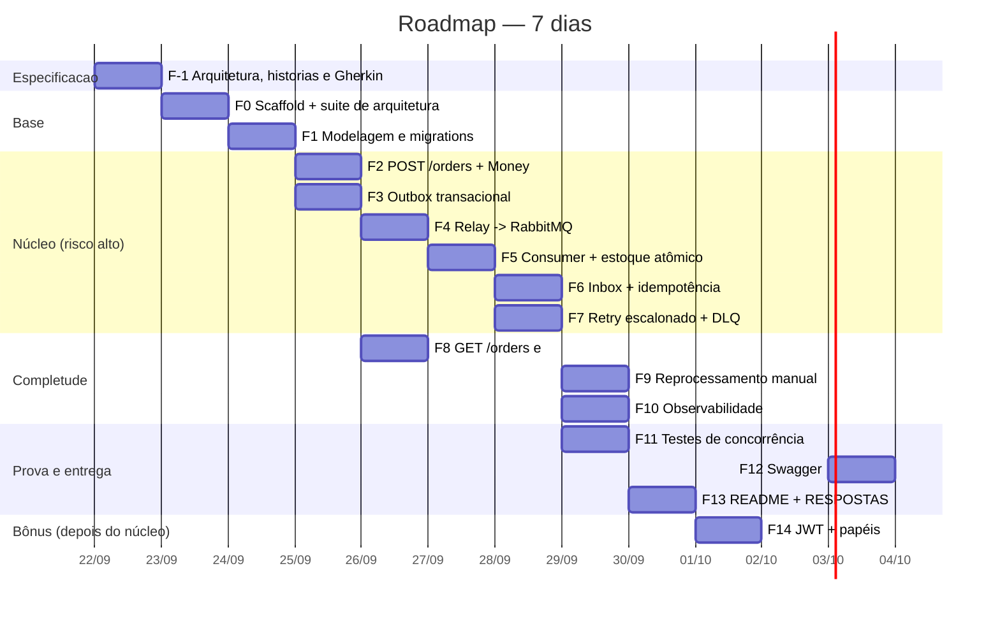

# PLAN.md — Plano de implementação

Plano de execução do teste técnico, fase a fase, com critério de pronto verificável
em cada uma e o commit que a fecha. O desenho técnico completo está em
[`ARCHITECTURE.md`](./ARCHITECTURE.md), as histórias em
[`USER_STORIES.md`](./USER_STORIES.md) e o método de desenvolvimento em
[`TESTING.md`](./TESTING.md); aqui está a **ordem** e o **como se prova**.

---

## 1. Regras de execução

1. **Nada é commitado sem rodar.** Cada fase tem um comando de verificação. Se o
   comando não passa, a fase não fechou.
2. **TDD, de verdade.** Nenhuma linha de código de produção nasce sem um teste
   vermelho pedindo por ela, e o vermelho é lido antes de virar verde — falha por
   `undefined is not a function` não provou nada. O ciclo completo (cenário
   Gherkin por fora, red-green-refactor por dentro) está em `TESTING.md` §2.
   Exceção honesta e declarada: código de ligação (módulo Nest, `main.ts`,
   migration gerada), coberto pela suíte de arquitetura e pelo `compose up`.
3. **Teste junto com a feature, no mesmo commit.** Um commit `test:` separado só
   existe para as suítes de concorrência, que são um esforço próprio.
4. **`main` direto, sem PR.** Histórico linear em Conventional Commits, 15 commits
   temáticos na ordem em que um humano resolveria o problema — começando pelo
   desenho, porque foi nessa ordem que o trabalho aconteceu.
5. **Nenhuma etapa "de mentira".** Sem mock de MySQL, sem fila fake, sem `TODO`
   entregue, com o porquê de cada decisão registrado em ADR.
6. **Ordem de ataque: o risco primeiro.** Outbox, decremento atômico e idempotência
   vêm antes de Swagger e paginação. O que pode dar errado é resolvido enquanto há
   prazo para refazer.

---

## 2. Roadmap

---

## 3. O teste que abre cada fase

TDD numa fase começa escolhendo **qual teste escrever primeiro** — aquele que
está vermelho pelo motivo certo e cuja correção obriga a escrever a peça central
da fase. Não é o teste mais fácil; é o que aponta para o risco.

| Fase | Primeiro teste (vermelho) | Por que este, e não outro |
|---|---|---|
| F0 | `layer-boundaries.spec.ts` › "existe código em `src/` para analisar" | força o scaffold a nascer já na forma que a arquitetura promete |
| F1 | `schema-invariants.spec.ts` | a migration é escrita para satisfazer as constraints, não o contrário — `UNIQUE(order_id, product_id)` não pode ser lembrada depois |
| F2 | `order-total.calculator.spec.ts` com `0.10 × 3` | o caso do arredondamento antes do caminho feliz: é ele que obriga o `Money` a existir |
| F3 | cenário `@dual-write @falha` de `criacao-de-pedido.feature` | o teste de atomicidade primeiro; o caminho feliz passa de graça depois |
| F4 | `relay-publish.spec.ts` | *publisher confirm* antes de `PUBLISHED` — escrever o feliz primeiro esconde a perda de mensagem |
| F5 | cenário `@rn2 @falha-real` de `estoque-reserva.feature` | estoque insuficiente antes do sucesso: é a asserção "estoque **inalterado**" que obriga o `UPDATE` condicional |
| F6 | cenário `@rn4 @idempotencia` de `estoque-reserva.feature` (reentrega) | prova que a constraint existe antes de haver código que confia nela |
| F7 | `retry-policy.spec.ts` › "erro de negócio não é retentado" | a classificação antes da mecânica de filas |
| F8 | cenário `@paginacao @borda` (página além do fim) | a borda antes do caminho feliz |
| F9 | cenário `@estado-invalido` (409 em `PROCESSED`) | a guarda de estado antes da ressurreição do pedido |
| F10 | cenário `@correlation-id` de `observabilidade.feature` | a propagação ponta a ponta, que é o que dá valor ao log |
| F11 | `oversell.spec.ts` | o cenário obrigatório do enunciado, com a suíte já madura para suportá-lo |
| F14 | `roles.guard.spec.ts` › "papel insuficiente é 403, não 401" | a distinção que separa autenticação de autorização |

Em toda fase, o último passo antes do commit é `npm run test:arch`: é comum
resolver um problema puxando um import que fura uma fronteira, e esse é
justamente o momento em que ninguém percebe.

---

## 4. Fases

### F-1 — Desenho antes do código

**Entrega:** `docs/ARCHITECTURE.md`, `docs/PLAN.md`, `docs/USER_STORIES.md`,
`docs/TESTING.md` e os nove `features/*.feature` — os dois problemas difíceis
(dual write e overselling) identificados e resolvidos no papel antes de existir
qualquer linha de código, com C4, ERD, máquinas de estado, diagramas de sequência,
ADRs, as nove histórias com critérios de aceite e os 82 casos Gherkin que vão
guiar o TDD.

**Pronto quando:** todo `.feature` parseia, aponta para uma user story e cobre um
requisito do enunciado; a matriz do `TESTING.md` lista o teste de cada item.

**Commit 1** — `docs: desenha a arquitetura, escreve as histórias e especifica o comportamento em Gherkin`

---

### F0 — Scaffold e infraestrutura local

**Entrega:** um `docker compose up -d --wait` que sobe MySQL, RabbitMQ e os três
papéis da aplicação, com health check verde.

- `nest new` com TypeScript estrito (`strict: true`, `noUncheckedIndexedAccess`).
- `src/main.ts` selecionando o papel por `APP_ROLE` (`api` | `relay` | `consumer`).
- `Dockerfile` multi-stage único para os três papéis.
- `docker-compose.yml`: `mysql`, `rabbitmq` (com management UI), `migrate`, `api`,
  `relay`, `consumer` — este último com `deploy.replicas` ajustável.
- `docker-compose.test.yml` em portas dedicadas (MySQL 33307, RabbitMQ 5673).
- Validação de ambiente na subida: o processo **não sobe** com env faltando.
- ESLint com `eslint-plugin-boundaries` e a política de camadas do ADR-012.
- `GET /health/live` e `GET /health/ready` (readiness checa MySQL e RabbitMQ).
- **Suíte de arquitetura** em `test/architecture/` (ADR-015): fronteiras, nomes,
  invariantes de código e integridade da matriz de testes. É o primeiro alvo do
  TDD — ela nasce vermelha em "existe código em `src/` para analisar" e é o
  scaffold que a faz passar.
- **Harness de BDD**: `jest-cucumber` ligando `features/` a `test/bdd/`, e
  `test/support/` com subida da app, banco de teste, publicação direta na fila,
  barreira de largada e limpeza entre cenários.
- Projetos do Jest separados por nível e os scripts `test:arch`, `test:unit`,
  `test:fast`, `test:bdd`, `test:int`, `test:concurrency`, `test:all`.

**Pronto quando:** `docker compose up -d --wait` volta sem erro,
`curl localhost:3000/health/ready` responde 200 e `npm run test:fast` fica verde
em menos de 5 s, sem Docker.

**Commit 2** — `chore: inicializa NestJS com papéis por APP_ROLE, Docker Compose, lint de fronteiras e suíte de arquitetura`

---

### F1 — Modelagem de dados

**Entrega:** o schema da seção 6 do `ARCHITECTURE.md`, criado por migration.

- Entidades TypeORM: `Order`, `OrderItem`, `Product`, `StockReservation`,
  `OutboxMessage`, `InboxMessage`.
- Migration inicial com **tudo explícito**: `CHECK`, coluna gerada `line_total`,
  índices compostos, `utf8mb4_0900_ai_ci`, InnoDB.
- Migration de seed: 5 produtos com `stock = 5`.
- `synchronize: false` em todos os ambientes.

**Pronto quando:** `npm run migration:run` num banco vazio produz o schema, e
`SHOW CREATE TABLE orders` mostra os índices e os `CHECK` esperados.

**Commit 3** — `feat(db): modela pedidos, itens, catálogo, reservas, outbox e inbox no MySQL`

---

### F2 — Criar pedido

**Entrega:** `POST /orders` respondendo 201 com o pedido `PENDING`.

- `Money` sobre `decimal.js`; `OrderTotalCalculator` puro.
- DTOs com `class-validator` (`items` não vazio, `quantity >= 1`, `price` decimal
  positivo, `customerName` com tamanho limitado).
- Resolução `productName → product_id` (422 se o produto não existir — validar
  **existência** não é validar **estoque**, que segue assíncrono).
- Filtro global de exceção com corpo de erro padronizado.
- **Testes unitários** do cálculo do total, incluindo casos de arredondamento.

**Pronto quando:** `POST` com dois itens devolve o total correto e a linha existe em
`orders` com `status = 'PENDING'`.

**Commit 4** — `feat(orders): cria pedido com cálculo de total em Money e validação de entrada`

---

### F3 — Outbox transacional  ← *o commit que resolve o dual write*

**Entrega:** pedido e evento gravados na mesma transação.

- `UnitOfWork` sobre `QueryRunner`: a mesma transação atravessa os repositórios.
- `OrderCreatedEvent` (evento de domínio tipado e versionado) serializado para a
  outbox com `event_id` UUIDv7 e `correlationId`.
- Teste de integração de **atomicidade**: falha forçada no `INSERT` da outbox deve
  deixar `orders` vazia.

**Pronto quando:** existe teste que prova que não é possível ter pedido sem evento.

**Commit 5** — `feat(outbox): grava order.created na mesma transação do pedido`

---

### F4 — Relay para o RabbitMQ

**Entrega:** o papel `relay` drenando a outbox para o broker.

- Topologia AMQP declarada de forma idempotente na subida (seção 8).
- Loop com `SELECT ... FOR UPDATE SKIP LOCKED LIMIT 50`.
- *Publisher confirms* antes de marcar `PUBLISHED`; backoff em `available_at` na falha.
- Reconexão automática e shutdown gracioso.

**Pronto quando:** um `POST /orders` faz a mensagem aparecer na fila `orders.created`
na UI do RabbitMQ (`localhost:15672`) em menos de 1 s.

**Commit 6** — `feat(relay): publica a outbox no RabbitMQ com SKIP LOCKED e publisher confirms`

---

### F5 — Consumer e reserva de estoque  ← *o commit que resolve o overselling*

**Entrega:** o papel `consumer` levando o pedido a `PROCESSED` ou `FAILED`.

- `ProcessOrderUseCase`: `sleep` simulado, itens ordenados por `product_id`,
  `UPDATE products SET stock = stock - :q WHERE id = :id AND stock >= :q`,
  `INSERT` da reserva, transição condicional de status — tudo numa transação.
- `affectedRows = 0` ⇒ `BusinessRuleViolation('INSUFFICIENT_STOCK')` com a mensagem
  `"estoque insuficiente"`.
- `prefetch`, ack manual **depois** do commit.
- Testes de integração: caminho feliz e **estoque insuficiente**.

**Pronto quando:** o pedido vira `PROCESSED` sozinho após o `POST`, e um pedido
maior que o estoque vira `FAILED` com o motivo certo, sem mexer no estoque.

**Commit 7** — `feat(consumer): reserva estoque com decremento condicional atômico e conclui o pedido`

---

### F6 — Idempotência

**Entrega:** reentrega não produz efeito duplicado.

- `INSERT` na inbox como primeira operação da transação; `ER_DUP_ENTRY` ⇒ ack e sai.
- Tratamento da violação de `UNIQUE(order_id, product_id)` como "já reservado".
- Teste: mesma mensagem entregue duas vezes ⇒ um decremento.

**Pronto quando:** publicar o mesmo `event_id` duas vezes deixa o estoque
decrementado uma única vez.

**Commit 8** — `feat(consumer): deduplica reentrega com inbox persistente por consumidor`

---

### F7 — Retry escalonado e dead-letter

**Entrega:** o requisito 5 do enunciado, completo.

- `RetryPolicy` pura: `(erro, tentativa) → RETRY(tier) | DEAD_LETTER | FAIL_BUSINESS`.
- Gatilho de falha simulada: `customerName` contendo `"fail"` lança `TransientError`.
- Republicação em `orders.retry.{5s,15s,45s}` com header `x-attempt`.
- Esgotou: `FAILED` com `RETRIES_EXHAUSTED` + a mensagem real do erro em
  `failure_reason`, e cópia em `orders.dead`.
- **Testes unitários** da política e **de integração** do ciclo completo.

**Pronto quando:** um pedido com `"fail"` no nome termina `FAILED` com motivo salvo e
uma mensagem visível em `orders.dead`.

**Commit 9** — `feat(consumer): classifica erro transitório e aplica retry escalonado com dead-letter`

---

### F8 — Consultas

**Entrega:** `GET /orders/:id` e `GET /orders?page=&limit=&status=`.

- 404 tipado para id inexistente; `limit` máximo de 100.
- Resposta com `meta: { page, limit, total, totalPages }`.
- Teste de borda: última página parcial, página além do fim.

**Commit 10** — `feat(orders): consulta por id e listagem paginada com filtro por status`

---

### F9 — Reprocessamento manual

**Entrega:** `POST /orders/:id/reprocess` (bônus).

- Só de `FAILED`; 409 caso contrário (verificando `affectedRows`).
- Volta para `PENDING` e grava **novo** `event_id` na outbox — a sutileza da
  seção 9.7.
- **Não** apaga as reservas anteriores. Apagá-las removeria exatamente a barreira
  que impede o decremento duplo: o reprocessamento atravessa a inbox e a checagem
  de estado de propósito, e a chave única é a única camada que sobra.

**Commit 11** — `feat(orders): reprocessamento manual de pedido FAILED`

---

### F10 — Observabilidade

**Entrega:** o roteiro de investigação da seção 14 funcionando.

- Pino com log JSON; `AsyncLocalStorage` carregando `correlationId`.
- Interceptor HTTP: aceita `x-correlation-id` ou gera; devolve no header da resposta.
- Propagação: coluna `orders.correlation_id` → payload da outbox → header AMQP → logs
  do relay e do consumer.
- Redação de campos sensíveis no log.

**Pronto quando:** `docker compose logs | grep '"correlationId":"<id>"'` mostra a
linha do tempo completa nos três processos.

**Commit 12** — `feat(observability): log estruturado em JSON com correlation ID de ponta a ponta`

---

### F11 — Concorrência: a prova

**Entrega:** a seção 11.4 do `ARCHITECTURE.md` e os quatro cenários de `estoque-concorrencia.feature` como suíte executável.

- 10 pedidos concorrentes com barreira de largada sobre `stock = 5`, e o caso de
  quantidades desiguais competindo pelo mesmo estoque.
- Reentrega simultânea da mesma mensagem.
- Deadlock por ordem oposta de produtos.
- Dois relays sobre a mesma outbox — a única sem cenário Gherkin, porque
  `SKIP LOCKED` é comportamento de infraestrutura, não de negócio.

**Pronto quando:** as quatro suítes passam 10 execuções seguidas sem *flake*.

**Commit 13** — `test(concurrency): overselling, reentrega simultânea, relays paralelos e deadlock`

---

### F12 — Swagger

**Entrega:** `/docs` navegável com exemplos de request e response por endpoint,
incluindo os corpos de erro.

**Commit 14** — `feat(docs): documenta a API com Swagger/OpenAPI em /docs`

---

### F13 — Documentação de entrega

**Entrega:** `README.md` (arquitetura, como rodar, endpoints, testes),
`RESPOSTAS.md` (as 5 perguntas de arquitetura), revisão do `docs/ARCHITECTURE.md`
contra o que foi de fato construído (ADRs que mudaram na prática, decisões que
apareceram) e `requests/orders.http` com o passo a passo executável.

**Commit 15** — `docs: README com instruções de execução e respostas de arquitetura`

---

### F14 — Autenticação (depois do núcleo, conforme combinado)

`POST /auth/login`, `JwtAuthGuard` global com `@Public()`, `@Roles('ADMIN')` no
reprocessamento, usuário de teste semeado, e a seção do README sobre a troca por
Keycloak/Auth0 via JWKS.

**Commit 16** — `feat(auth): protege os endpoints com JWT e controle de acesso por papel`

---

### F15 — SSO com Keycloak

**Entrega:** `AUTH_PROVIDER` selecionando entre o provedor local e o Keycloak,
com as duas portas de identidade (`TokenVerifier`, `CredentialsAuthenticator`) e
os dois adaptadores.

- Realm importado (`docker/keycloak/realm-loja.json`) com client, papéis e usuários.
- `docker-compose.keycloak.yml` como sobreposição, para o caminho padrão seguir rápido.
- `JwksCache` próprio: cache com TTL, *rate limit* na renovação e chave velha
  servida quando a renovação falha.
- `autenticacao.feature` passa a rodar **duas vezes**, uma por provedor.

**Pronto quando:** `npm run keycloak:up` sobe, o login devolve RS256 e os mesmos
cenários de `autenticacao.feature` passam nos dois provedores.

**Commit 17** — `feat(auth): integra Keycloak como provedor de identidade selecionável`

---

### F16 — Carga com k6

**Entrega:** `desempenho.feature` como suíte executável em `load/k6/`.

- Cenário síncrono, cenário ponta a ponta, saturação e escala, overselling pela HTTP.
- `load/prep.sh` limpando banco **e purgando as filas** antes de cada rodada.

**Pronto quando:** os quatro cenários rodam e os números estão registrados em
`load/README.md`.

**Commit 18** — `test(load): mede latência, vazão e overselling sob carga com k6`

---

## 5. Mapa commit → critério de avaliação

| Critério (peso) | Commits que o atendem |
|---|---|
| Modelagem de dados (15%) | 1, 3 |
| Funcionalidade correta (20%) | 4, 7, 10, 11 |
| Fila / falha / concorrência (20%) | 5, 6, 7, 8, 9, 13 |
| Autenticação e autorização (15%) | 16 |
| Testes (15%) | 1 (Gherkin + matriz), 2 (suíte de arquitetura), 4, 7, 8, 9, 13 — teste junto da feature, em TDD |
| Organização / observabilidade / README (15%) | 1, 2, 12, 14, 15 |

---

## 6. Riscos e resposta

| Risco | Probabilidade | Resposta |
|---|---|---|
| Teste de concorrência *flaky* por pool de conexões pequeno demais para o paralelismo | Alta | Dimensionar o pool acima do número de tarefas concorrentes e usar barreira de largada explícita, não `setTimeout` |
| TTL do RabbitMQ + DLX devolvendo para a fila errada | Média | Testar a topologia isoladamente na F4, antes de haver lógica em cima |
| `DECIMAL` do TypeORM chegando como `number` e perdendo centavo | Média | `transformer` na coluna convertendo direto para `Money`; teste unitário de ida e volta |
| Deadlock InnoDB em pedidos multi-item sob carga | Média | Ordenação por `product_id` (F5) + classificação como transitório (F7) |
| `docker compose up` falhar na máquina do avaliador por porta ocupada | Baixa | Portas configuráveis por `.env`, `.env.example` documentado, health check com `--wait` |
| Tempo acabar antes da F14 (auth) | Média | Núcleo fechado até a F13; auth é a última fase justamente por ser bônus |

---

## 7. Checklist de entrega

- [ ] `docker compose up -d --wait` sobe tudo em máquina limpa
- [ ] `POST /orders` → 201 `PENDING`; segundos depois, `GET /orders/:id` → `PROCESSED`
- [ ] Pedido acima do estoque → `FAILED` com `"estoque insuficiente"`
- [ ] `customerName` com `"fail"` → 3 tentativas, dead-letter, `FAILED` com motivo
- [ ] Estoque nunca negativo com 10 pedidos concorrentes
- [ ] Retry não decrementa duas vezes
- [ ] `GET /orders?page=2&limit=5` pagina corretamente
- [ ] `POST /orders/:id/reprocess` ressuscita um `FAILED`
- [ ] `npm run test:fast` (arquitetura + unitários) verde em menos de 5 s, sem Docker
- [ ] Suítes de BDD, integração e concorrência verdes contra MySQL e RabbitMQ reais
- [ ] Os 82 casos dos nove `.feature` passando, nenhum pulado sem justificativa
- [ ] Nenhuma linha da matriz do `TESTING.md` ainda marcada com ⏳
- [ ] Suítes de concorrência passando 10 execuções seguidas, sem *flake*
- [ ] Swagger em `/docs`
- [ ] `correlationId` rastreável da API ao consumer
- [ ] README, RESPOSTAS.md, ARCHITECTURE.md, USER_STORIES.md e TESTING.md coerentes com o código entregue
- [ ] Histórico em Conventional Commits, legível de cima a baixo
