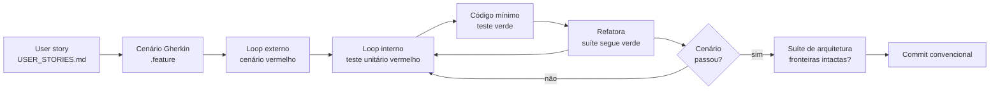
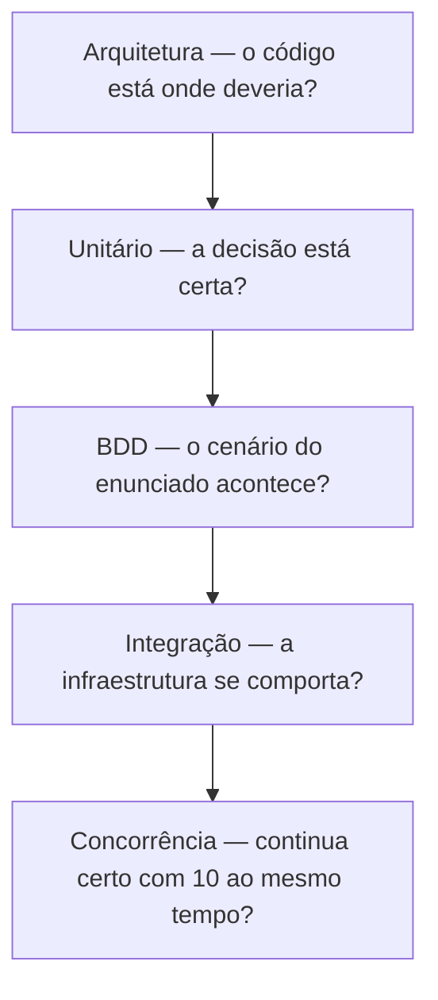

# TESTING.md — Estratégia de testes, BDD e TDD

Este documento responde três perguntas, nesta ordem:

1. **Como eu desenvolvo** — o ciclo TDD que governa cada commit.
2. **O que eu testo, em que nível, e por quê** — incluindo a suíte de arquitetura.
3. **Qual teste prova qual coisa** — a matriz completa, arquivo por arquivo.

O desenho técnico está em [`ARCHITECTURE.md`](./ARCHITECTURE.md), as histórias em
[`USER_STORIES.md`](./USER_STORIES.md) e a ordem de execução em
[`PLAN.md`](./PLAN.md).

---

## 1. O critério que decide se um teste vale a pena

> **Este teste falharia se o bug existisse?**

É a única pergunta. Um teste de `POST /orders` que mocka o repositório e afirma
que o repositório foi chamado passa com o bug de overselling presente, com a
outbox quebrada e com o total errado por arredondamento. Ele não vale nada — pior,
ele dá a sensação de que vale.

Daí decorrem três regras que valem para tudo neste repositório:

1. **O que é atômico se testa contra o banco de verdade.** `affectedRows = 0` num
   `UPDATE` condicional sob lock concorrente do InnoDB **só existe no MySQL**
   (ADR-013). Fake de repositório não reproduz isso.
2. **O que é decisão se testa isolado.** `RetryPolicy`, cálculo de total, transição
   de status: funções puras, sem I/O, em milissegundos.
3. **O que é estrutura se testa por leitura de código.** Fronteiras entre camadas
   não são comportamento em runtime; são propriedade do grafo de importação, e é
   assim que se verificam (§4).

**O que uma varredura por asserção encontrou.** Seis steps de BDD tinham corpo
`() => undefined`: o cenário prometia e o teste não verificava. Corrigi-los
destravou três defeitos que estavam escondidos:

| Defeito | Estava escondido atrás de |
|---|---|
| Um cenário passava **pelo motivo errado**: o envelope publicado ia sem `correlationId`, morria como `MALFORMED_EVENT` e nunca chegava ao caminho `ORDER_NOT_FOUND` que dizia testar | `um log de nível "error" é emitido com o orderId` sem asserção |
| `global.fetch` substituído por um dublê e **nunca restaurado** entre cenários — o cenário seguinte recebia um `fetch` que sempre lança | `o realm importado com os usuários e papéis` sem asserção |
| Um exemplo do enunciado descrevia comportamento **impossível**: `PRODUCT_NOT_FOUND` no worker não acontece, porque a FK `ON DELETE RESTRICT` impede o produto de sumir. O step tinha uma válvula de escape (`if (fila === 'orders.dead') return`) que pulava justamente a asserção do cenário | o exemplo só funcionava com o caso de uso mockado |

---

## 2. O ciclo: TDD com BDD por fora

O desenvolvimento é feito em **duplo loop**. O loop de fora é o cenário de
negócio, escrito em Gherkin antes de qualquer código. O loop de dentro é o
red-green-refactor da unidade.



**A ordem exata de cada incremento**

| Passo | O que acontece | Estado da suíte |
|---|---|---|
| 1 | Escolho a história e escrevo os cenários dela no `.feature` | vermelho (cenário sem step) |
| 2 | Escrevo o step definition chamando o comportamento que **ainda não existe** | vermelho (não compila) |
| 3 | Desço para a unidade: escrevo o `*.spec.ts` da decisão que falta | vermelho (asserção falha) |
| 4 | Escrevo o **código mínimo** que faz o unitário passar | verde no interno |
| 5 | Repito 3–4 até o cenário externo passar | verde no externo |
| 6 | Refatoro com a rede toda verde | verde |
| 7 | Rodo `npm run test:arch` — nenhuma fronteira furada no caminho | verde |
| 8 | Commit único com feature + teste juntos | — |

**Regras do ciclo, que eu me comprometo a seguir**

- **Nunca escrevo código de produção sem um teste vermelho pedindo por ele.** A
  exceção honesta: código de ligação (módulo Nest, `main.ts`, migration gerada) —
  esse é verificado pelo teste de arquitetura e pelo `docker compose up`, não por
  unitário próprio.
- **Vermelho tem que ser vermelho pelo motivo certo.** Antes de implementar, eu
  leio a mensagem de falha. Teste que falha por `undefined is not a function` não
  provou nada ainda.
- **Código mínimo é mínimo mesmo.** Se o teste passa com uma constante, escrevo a
  constante, e o próximo teste força a generalização. É assim que a lógica de
  retry ganhou três casos em vez de um `if` adivinhado.
- **Refatorar é passo, não intenção.** O passo 6 não é opcional, e é o único
  momento em que mudo forma sem mudar comportamento.
- **Teste e feature no mesmo commit.** Um commit `test:` separado só existe para as
  suítes de concorrência, que são um esforço próprio (PLAN §1).

---

## 3. Os cinco níveis

| Nível | Onde | Quantos | I/O | Tempo alvo | Roda quando |
|---|---|---|---|---|---|
| **Arquitetura** | `test/architecture/` | 42 asserções | lê arquivos | < 2 s | a cada save |
| **Unitário** | `test/unit/` | 28 arquivos, 228 testes | nenhum | < 5 s | a cada save |
| **BDD / aceitação** | `test/bdd/` | 8 features, 78 casos | MySQL + RabbitMQ reais | ~15 s | antes do commit |
| **Integração técnica** | `test/integration/` | 5 arquivos, 25 testes | MySQL + RabbitMQ reais | ~10 s | antes do commit |
| **Concorrência** | `test/concurrency/` | 4 arquivos, 7 testes, 1 feature | paralelismo real | ~15 s | antes do push |



Não é a pirâmide clássica por acaso: a base larga é barata (arquitetura e unitário
não precisam de Docker), e o topo caro existe porque os dois bugs que realmente
podem acontecer neste sistema — dual write e overselling — **não são detectáveis
em nenhum nível abaixo**.

---

## 4. Testes de arquitetura (fitness functions)

`eslint-plugin-boundaries` (ADR-012) verifica fronteiras no lint. A suíte de
arquitetura verifica o que o lint não alcança: caminho **transitivo**, ausência de
arquivo obrigatório, ciclo de importação, invariante de texto e integridade da
própria suíte de testes. Rodam como teste unitário comum, sem nenhuma dependência
nova.

| Arquivo | O que prova | Bug que ele pega |
|---|---|---|
| `layer-boundaries.spec.ts` | política de camadas do ADR-012, caminho transitivo até `messaging`, ausência de ciclos, dono de cada pacote | o controller passando a chamar o publisher por meio de um helper — o RT3 furado sem ninguém ver na revisão |
| `naming-and-structure.spec.ts` | estrutura da §2.4, sufixos por fatia, kebab-case, um caso de uso por pasta, porta sem implementação | pasta nova fora do desenho; `ProcessOrderService` largado em `infrastructure/` |
| `code-invariants.spec.ts` | `console.*`, `process.env` fora do config, `synchronize: true`, SQL fora de `persistence`, dinheiro como `number`, `as any`, `.only` em teste | `synchronize: true` num ambiente; `total: number` reintroduzindo erro de centavo; CI verde rodando um teste só |
| `test-suite-integrity.spec.ts` | todo arquivo de domínio/aplicação tem `.spec.ts`; todo `.feature` é rastreável a uma user story; todo requisito tem cenário; **todo arquivo de teste é alcançado por algum projeto do Jest**; matriz e disco não divergem | caso de uso entregue sem teste unitário; requisito sem cenário; **teste que existe, está documentado e nunca roda** |

**Como rodar:** `npm run test:arch` — sem Docker, sem banco, ~1,5 s.

**A suíte acompanha a fase do projeto.** Das 42 asserções, 35 leem `src/` e 7 leem
`features/`, `docs/` e `test/`. Com o código no lugar, as 42 estão ativas.

Enquanto `src/` não existia — a fase de especificação, com arquitetura, histórias
e Gherkin escritos e nenhuma linha de código — as 35 ficavam **inativas e
visíveis** na saída do Jest, com o motivo no nome do bloco. A alternativa seria
deixá-las passar: uma regra de fronteira avaliada sobre zero arquivo devolve zero
violações e fica verde. Seria um verde que não prova nada e que some no meio da
suíte — exatamente o tipo de teste que este documento abre dizendo que não vale.

Não houve nada para religar: o gate é `existsSync('src/')`. Quando a F0 criou o
scaffold, as 35 voltaram a valer sozinhas. A primeira delas, "existe código em
`src/` para analisar", continua protegendo contra o caso em que `src/` existe mas o
leitor de arquivos quebrou num refactor.

**Como as regras foram verificadas.** Cada regra foi exercitada contra uma árvore
sintética com a violação injetada, e observada falhando com o caminho do arquivo
culpado na mensagem. Um teste de arquitetura que nunca ficou vermelho é um teste
que talvez não esteja lendo arquivo nenhum.

**O que elas pegaram de verdade.** Duas coisas, e nenhuma delas era hipotética:

1. `health.e2e-spec.ts` existia, estava nesta matriz e **nunca era executado**: o
   padrão `*.spec.ts` não casa com um nome cujo separador antes de `spec` é hífen.
   O arquivo contava na revisão e não contava no CI. A regra "todo arquivo de teste
   é alcançado por algum projeto do Jest" nasceu desse achado e foi verificada
   reproduzindo-o.
2. Um falso positivo meu: a regra de dinheiro incluía a palavra `total`, que em
   `meta.total` é a contagem de registros da paginação — legitimamente um number.
   Seis violações falsas. Regra de arquitetura que grita errado é regra que o time
   aprende a ignorar, então a palavra saiu da lista e a compensação foi apertar a
   regra de **conversão** (`parseFloat`, `Number(...price)`, `.toNumber()`), que é
   onde o centavo some de fato.

**Como adicionar uma regra.** Toda regra mora numa tabela declarativa no topo do
arquivo (`ALLOWED_LAYERS`, `ALLOWED_SUFFIXES`, `RULES`). Afrouxar uma regra exige
editar essa tabela — o atrito é intencional: é uma decisão de arquitetura, não um
detalhe de implementação.

**Sobre o marcador ⏳ na matriz.** A matriz da §6 foi escrita antes do código. Uma
linha marcada com é backlog declarado, e `test-suite-integrity.spec.ts` a
ignora. Tirar o ⏳ é o passo "agora este teste existe" — e a partir daí o arquivo
precisa existir de verdade, ou a suíte fica vermelha.

---

## 5. BDD: a especificação é executável

Os `.feature` em `features/` são escritos em **Gherkin em português**
(`# language: pt`) e ligados ao código por [`jest-cucumber`](https://github.com/bencompton/jest-cucumber),
que roda dentro do Jest — sem runner paralelo, sem relatório separado, sem
segunda configuração de CI.

```
features/                                   quem executa
├── criacao-de-pedido.feature          ──►  test/bdd/criacao-de-pedido.steps.spec.ts
├── processamento-assincrono.feature   ──►  test/bdd/processamento-assincrono.steps.spec.ts
├── consulta-de-pedidos.feature        ──►  test/bdd/consulta-de-pedidos.steps.spec.ts
├── estoque-reserva.feature            ──►  test/bdd/estoque-reserva.steps.spec.ts
├── retry-e-dead-letter.feature        ──►  test/bdd/retry-e-dead-letter.steps.spec.ts
├── reprocessamento-manual.feature     ──►  test/bdd/reprocessamento-manual.steps.spec.ts
├── autenticacao.feature               ──►  test/bdd/autenticacao.steps.spec.ts
├── observabilidade.feature            ──►  test/bdd/observabilidade.steps.spec.ts
├── saude-do-servico.feature           ──►  test/bdd/saude-do-servico.steps.spec.ts
├── documentacao-da-api.feature        ──►  test/bdd/documentacao-da-api.steps.spec.ts
├── autenticacao-sso.feature           ──►  test/bdd/autenticacao-sso.steps.spec.ts
├── estoque-concorrencia.feature       ──►  test/concurrency/*.spec.ts
└── desempenho.feature                 ──►  load/k6/*.js
```

**`autenticacao.feature` roda duas vezes**, e é o único arquivo com dois donos de
propósito: `autenticacao.steps.spec.ts` (provedor local, HS256) e
`autenticacao-keycloak.steps.spec.ts` (Keycloak, RS256/JWKS). Os dois
compartilham os mesmos step definitions em `test/support/autenticacao.steps.ts` —
duplicar o arquivo funcionaria e apodreceria na primeira mudança de cenário.

É a prova executável de que trocar o provedor de identidade não muda o contrato
público da API. O que é **específico** do SSO — JWKS, papel desconhecido do
realm, provedor fora do ar — vive em `autenticacao-sso.feature`, com steps
próprios.

**Por que Gherkin aqui, e não só `describe`/`it`.** O enunciado tem um cenário de
concorrência descrito em prosa, e a avaliação é sobre *qual estratégia eu escolho
e como justifico*. Um `.feature` deixa o cenário legível por quem não abre o
código, e deixa explícito o que foi prometido — inclusive as bordas que normalmente
ficariam só na minha cabeça (última página parcial, `limit` acima do teto, dois
cliques no botão de reprocessar).

**Um cenário, um dono.** Cada cenário é executado em **um** lugar só, e a
separação é **física**: um arquivo `.feature` inteiro pertence a uma suíte, não a
duas. Por isso as regras de estoque estão partidas em dois arquivos.

| Arquivo | Dono | Por quê |
|---|---|---|
| `estoque-reserva.feature` | `test/bdd/estoque-reserva.steps.spec.ts` | comportamento de um pedido por vez: cabe no harness de steps |
| `estoque-concorrencia.feature` | `test/concurrency/*.spec.ts` | precisa de barreira de largada, pool dimensionado acima do paralelismo e repetição — controle que a camada de steps não dá sem virar gambiarra |

Não existe `tagFilter` em lugar nenhum. Filtro por tag funciona, mas é uma
convenção invisível: quem abre o `.feature` não vê que metade dele não roda ali.
Dois arquivos com um cabeçalho dizendo quem os executa não têm esse problema.

**O que os steps compartilham.** `test/support/` concentra subida da aplicação,
conexão com o banco de teste, publicação direta na fila, barreira de largada e
limpeza entre cenários. Step definition não abre conexão por conta própria.

**Isolamento entre cenários.** Cada cenário roda numa transação truncada ao final
(`TRUNCATE` na ordem das FKs) e com fila purgada. Não há ordem implícita entre
cenários, e nenhum depende do estado deixado por outro — o que permite rodar um
cenário isolado durante o TDD sem preparar nada à mão.

**Tags e o que elas servem**

| Tag | Uso |
|---|---|
| `@us-N` | liga o cenário à user story |
| `@rf1`…`@rn4`, `@b1`, `@b2`, `@b5` | liga ao requisito do enunciado (verificado por `test-suite-integrity.spec.ts`) |
| `@critico` | cenário que, se quebrar, bloqueia a entrega |
| `@falha-real` | cenário de falha de verdade, o que o enunciado cobra explicitamente |
| `@concorrencia` | marca o arquivo inteiro cujo dono é `test/concurrency/` |
| `@corrida` | cenário com duas requisições em paralelo — cabe nos steps, não precisa do harness de concorrência |
| `@borda` | caso de borda (última página, estoque exato, teto de `limit`) |

---

## 6. A matriz: qual teste prova qual coisa

Linhas com ⏳ ainda não foram escritas — é o backlog do TDD, na ordem das fases do
`PLAN.md`.

### 6.1 Unitários — domínio (sem I/O)

| Arquivo | O que prova | Bug que ele pega |
|---|---|---|
| `money.vo.spec.ts` | imutabilidade, soma, multiplicação, precisão de 12 dígitos, recusa de moedas diferentes | `0.1 + 0.2 !== 0.3`; `total += x` mutando o objeto |
| `order-total.calculator.spec.ts` | soma de `unitPrice × quantity` com `Money` | arredondamento de ponto flutuante (`0.10 × 3`), item único, precisão no limite de `DECIMAL(12,2)` |
| `order.entity.spec.ts` | transições válidas e inválidas da máquina de estado da §7.1 | `PROCESSED → PENDING`; `FAILED` sem motivo; marcar processado duas vezes |
| `order-item.entity.spec.ts` | `lineTotal` e o snapshot de `productName`/`unitPrice` | item passando a ler preço do produto atual e mudando pedido do passado |
| `order-created.event.spec.ts` | evento de domínio tipado e versionado, com `eventId` e `correlationId` | evento sem versão, quebrando consumidor antigo numa mudança de payload |
| `product.entity.spec.ts` | `canFulfill` e a recusa de estoque negativo em memória | invariante do agregado divergindo do `CHECK` do banco |
| `stock-reservation.entity.spec.ts` | identidade da reserva por `(orderId, productId)` e quantidade positiva | reserva com quantidade 0 ocupando a chave única |
| `domain.error.spec.ts` | raiz comum, nome da subclasse concreta, código separado da mensagem | erro genérico chegando ao log sem o código que o operador usa para buscar |
| `business-rule-violation.error.spec.ts` | o código que o consumidor grava em `failure_code` | pedido marcado FAILED sem dizer por quê |
| `validation.error.spec.ts` | entrada malformada não se confunde com regra de negócio | 422 virando 500, ou payload inválido marcando o pedido como falho |
| `not-found.error.spec.ts` | `ORDER_NOT_FOUND` com o código que o filtro HTTP vira 404 | ausência de recurso respondida como 500 |
| `conflict.error.spec.ts` | estado incompatível com o código que o filtro HTTP vira 409 | reprocessar pedido PROCESSED respondendo 200 |
| `transient.error.spec.ts` | fica fora da família de domínio e preserva a causa | deadlock tratado como fatal, perdendo o pedido |
| `business-error.guard.spec.ts` | separa o que se retenta do que não se retenta, inclusive diante de não-erros | erro de negócio caindo no `catch` de transitório e sendo retentado à toa |
| `user.entity.spec.ts` | papel de operador e ausencia de senha em claro | usuario comum conseguindo reprocessar pedido |
| `retry-policy.spec.ts` | decisão `RETRY(tier)` / `DEAD_LETTER` / `FAIL_BUSINESS` por erro e tentativa | retentar erro de negócio; estourar `MAX_ATTEMPTS` sem dead-letter; erro desconhecido classificado como fatal em vez de transitório |

### 6.2 Unitários — aplicação (portas trocadas por fakes em memória)

| Arquivo | O que prova | Bug que ele pega |
|---|---|---|
| `create-order.use-case.spec.ts` | pedido e evento vão para a **mesma** unidade de trabalho; total calculado pelo domínio; produto inexistente vira erro tipado | publicar fora da transação; calcular total no controller |
| `process-order.use-case.spec.ts` | ordem de operações: inbox → estado → reserva; itens ordenados por `product_id`; classificação do erro | reservar antes de checar o estado; ordem de itens não determinística reabrindo o deadlock |
| `reprocess-order.use-case.spec.ts` | só de `FAILED`; limpa motivo; gera `event_id` **novo** | reaproveitar o `event_id` antigo e a inbox descartar o reprocessamento em silêncio |
| `get-order.use-case.spec.ts` | erro tipado para id inexistente | 500 onde deveria ser 404 |
| `login.use-case.spec.ts` | credencial errada e usuario inexistente devolvem a MESMA resposta; sem token quando a senha nao confere | login virando oraculo de quais e-mails existem na base |
| `list-orders.use-case.spec.ts` | cálculo de `totalPages`, offset e teto de `limit` | `totalPages` errado na divisão exata; offset negativo |

> **O que um fake pode e o que não pode provar.** Aqui os fakes provam
> **orquestração**: quem é chamado, em que ordem, com quais argumentos, e o que
> acontece quando uma porta devolve erro. Eles **não** provam atomicidade nem
> concorrência — nenhum fake reproduz `affectedRows = 0` sob lock do InnoDB. Por
> isso todo caso de uso desta tabela tem um par obrigatório nas seções 6.4 e 6.5.
> Um unitário verde aqui sem o par lá é exatamente o teste que o enunciado chama
> de "vazio que só passa".

### 6.3 Unitários — infraestrutura, interface e workers

| Arquivo | O que prova | Bug que ele pega |
|---|---|---|
| `main.spec.ts` | `APP_ROLE` inicia o papel certo e só ele; papel desconhecido derruba a subida | container subindo como `api` quando deveria consumir a fila — todos os pedidos em PENDING, sem erro visível |
| `scrypt.hasher.spec.ts` | ida e volta do hash, sal por senha, hash malformado devolve `false` sem lançar | duas senhas iguais com o mesmo hash; a defesa de *timing* virando 500 |
| `pino.logger.spec.ts` | níveis, `correlationId` automático, identificação do papel e redação de segredo | linha de log sem correlação (metade das linhas some da investigação); token vazando no agregador |
| `transformers.spec.ts` | ida e volta DECIMAL↔Money e BIGINT↔number, incluindo nulos | ordenação por id virando lexicográfica (10 antes de 9); centavo perdido na leitura |
| `mysql.errors.spec.ts` | deadlock e lock timeout como transitórios; tudo mais intacto | deadlock tratado como fatal (perde o pedido); tabela ausente retentada 3× escondendo erro de migration |
| `env.schema.spec.ts` | env faltando ou malformada derruba a subida com mensagem clara | processo subindo e quebrando só na primeira requisição |
| `order.consumer.spec.ts` | árvore de decisão isolada do broker: entrega nula, ilegível, DEAD_LETTER, retentativa, tentativas esgotadas, erro de negócio | worker quebrando no shutdown ao receber entrega nula; erro de negócio girando 3× pelas filas de espera |
| `message.codec.spec.ts` | serialização do envelope: `eventId`, `version`, `correlationId`, header `x-attempt` | `x-attempt` perdido na republicação, zerando o contador de tentativas para sempre |
| `amqp.probe.spec.ts` | sonda devolve `false` sem lançar quando o broker está fora | readiness virando 500 em vez de "degradado" |
| `amqp.connection.spec.ts` | topologia declarada uma vez, reconexão após `close`, publisher confirm propagando o nack, shutdown tolerante | canal morto usado em silêncio após queda do broker; relay marcando PUBLISHED uma mensagem recusada |
| `consumer.worker.spec.ts` | shutdown do Nest para o consumo e drena o que está em voo | cada deploy devolvendo para a fila o que estava sendo processado |
| `relay.worker.spec.ts` | publica antes de marcar PUBLISHED, lote misto, backoff com teto, laço sobrevive a erro de ciclo | marcar publicado e perder tudo em voo quando o broker cai; erro de ciclo matando o relay em silêncio |
| `amqp.topology.spec.ts` | a topologia declarada (exchanges, filas, TTL, DLX) bate com a §8 | fila de retry devolvendo para a fila errada |
| `correlation.context.spec.ts` | `AsyncLocalStorage` mantém o id através de `await` e de callback do AMQP | correlationId sumindo no worker, que é justamente onde ele importa |
| `correlation-id.interceptor.spec.ts` | aceita `x-correlation-id` do cliente, gera quando ausente, devolve no header | id gerado novo a cada camada, quebrando a linha do tempo |
| `correlation-id.decorator.spec.ts` | o id vem do request; sem header, sem headers ou header não-texto devolve vazio | controller inventando um correlationId novo a cada chamada, quebrando o rastro de ponta a ponta |
| `http-exception.filter.spec.ts` | corpo de erro padronizado por classe de exceção; 500 não vaza stack | `BusinessRuleViolation` virando 500 |
| `http-exception.filter.extra.spec.ts` | corpo em string, status sem código próprio, log só em 5xx, `correlationId` no corpo | ruído de log em erro do cliente; 5xx sem stack registrada; erro sem id para investigar |
| `orders.controller.spec.ts` | repasse do correlationId, tradução pelo presenter, defesa contra header ausente | pedido nascendo com correlationId literal `"undefined"` — parece id de verdade na investigação |
| `health.controller.spec.ts` | liveness não toca em dependência; readiness devolve 503 com uma fora | health check derrubando containers saudáveis em cascata; container degradado entrando no balanceador |
| `auth.controller.spec.ts` | repasse ao caso de uso, sem reinterpretar a recusa | controller decidindo a resposta de credencial inválida e divergindo entre provedores |
| `order.presenter.spec.ts` | resposta expõe `total` como string decimal e não expõe coluna interna | `total: 29.990000000000002` no JSON |
| `create-order.dto.spec.ts` | validação de `items` não vazio, `quantity >= 1`, `price` decimal positivo, tamanho de `customerName` | quantidade 0 chegando no domínio |
| `login.dto.spec.ts` | e-mail e senha são obrigatórios e validados no contrato | corpo vazio chegando no caso de uso e virando 401 em vez de 400 |
| `list-orders.dto.spec.ts` | `page >= 1`, `limit` entre 1 e 100, `status` no enum | `limit=100000` varrendo a tabela |
| `jwks.cache.spec.ts` | cache sem ida ao provedor, rotação por `kid`, *rate limit* e chave velha servida quando a renovação falha | validação chamando o SSO por requisição (queda do provedor vira apagão); `kid` forjado virando DDoS contra o Keycloak |
| `keycloak-jwks.verifier.spec.ts` | RS256 válido, emissor/audiência errados, expirado, `alg confusion`, sem `kid`, JWKS inacessível | token de outro realm do mesmo Keycloak abrindo a API; `alg: HS256` usando a chave pública como segredo |
| `keycloak-credentials.authenticator.spec.ts` | 401/400 viram `null`; 5xx LANÇA | provedor fora do ar mascarado como "senha inválida" |
| `keycloak-roles.mapper.spec.ts` | papéis do Keycloak filtrados por allowlist antes de virarem privilégio | `offline_access` do provedor sendo aceito como papel da aplicação; papel novo criado no console virando privilégio sozinho |
| `local-credentials.authenticator.spec.ts` | devolve `null` em vez de exceção; verifica hash mesmo sem usuário | login virando oráculo de e-mails pelo tempo de resposta |
| `jwt-auth.guard.spec.ts` | token ausente, expirado, adulterado e com assinatura errada → 401; `@Public()` passa | token expirado aceito |
| `roles.guard.spec.ts` | papel insuficiente → **403**, não 401 | cliente conseguindo reprocessar pedido |

### 6.4 BDD — aceitação contra MySQL e RabbitMQ reais

| Arquivo | Feature | Cenário decisivo |
|---|---|---|
| `criacao-de-pedido.steps.spec.ts` | `criacao-de-pedido.feature` | **RT4 do enunciado**: `POST /orders` → 201 `PENDING`, itens gravados e **linha `PENDING` na outbox, na mesma transação**; e a falha forçada na outbox deixando `orders` vazia |
| `processamento-assincrono.steps.spec.ts` | `processamento-assincrono.feature` | com o consumidor parado o pedido fica `PENDING` e o `POST` continua 201 — o desacoplamento real, não declarado |
| `consulta-de-pedidos.steps.spec.ts` | `consulta-de-pedidos.feature` | bordas da paginação: última página parcial, página além do fim (200 com lista vazia), teto de `limit` |
| `estoque-reserva.steps.spec.ts` | `estoque-reserva.feature` | **cenário real de falha**: estoque insuficiente → `FAILED` com `"estoque insuficiente"`, estoque **inalterado**, nenhuma reserva órfã |
| `retry-e-dead-letter.steps.spec.ts` | `retry-e-dead-letter.feature` | **cenário real de falha**: `"fail"` no nome → 3 tentativas observadas, mensagem em `orders.dead`, `FAILED` com `RETRIES_EXHAUSTED` e o erro real salvo |
| `reprocessamento-manual.steps.spec.ts` | `reprocessamento-manual.feature` | `FAILED → PENDING` com `event_id` novo; 409 ao reprocessar `PROCESSED`; dois cliques simultâneos dando exatamente um 202 e um 409 |
| `autenticacao.steps.spec.ts` | `autenticacao.feature` (provedor **local**, HS256) | 401 sem token, 403 com papel errado, `/health/*` público |
| `autenticacao-sso.steps.spec.ts` | `autenticacao-sso.feature` — o que só existe no modo SSO: JWKS, papéis do realm, provedor fora do ar | integração de SSO que passa contra JWKS mockado e quebra em produção; queda do provedor virando apagão em vez de degradação |
| `autenticacao-keycloak.steps.spec.ts` | **o mesmo** `autenticacao.feature`, contra **Keycloak** (RS256/JWKS) | o contrato público da API mudando quando o provedor de identidade muda — token expirado de verdade, RS256 de chave fora do JWKS, papel vindo do `realm_access` |
| `documentacao-da-api.steps.spec.ts` | `documentacao-da-api.feature` | toda rota documentada existe e vice-versa; respostas com schema; exemplos do caminho de falha | documentação divergindo do código em silêncio — quem integra descobre pelo 404 |
| `saude-do-servico.steps.spec.ts` | `saude-do-servico.feature` | liveness não consulta dependência; readiness devolve 503 e nomeia quem caiu | health check reiniciando a frota inteira numa oscilação do MySQL |
| `observabilidade.steps.spec.ts` | `observabilidade.feature` | o mesmo `correlationId` aparece nos logs dos três processos, na coluna do pedido, no payload e no header AMQP |

### 6.5 Integração técnica — o que não é cenário de negócio

| Arquivo | O que prova | Bug que ele pega |
|---|---|---|
| `schema-invariants.spec.ts` | a migration produz de fato os `CHECK`, a coluna gerada `line_total`, os índices compostos e as chaves únicas da §6.2 | índice esquecido numa migration; `UNIQUE(order_id, product_id)` ausente — a garantia inteira de idempotência |
| `amqp-topology-declared.spec.ts` | a topologia existe **no broker**: exchanges, filas, TTL e DLX ligados como a §8 promete | mensagem de retry voltando para a fila errada e girando para sempre |
| `repositories.spec.ts` | contra MySQL real: `affected` do decremento condicional, chave duplicada vs. violação de FK, lista vazia, rollback devolvendo a conexão | `INSERT IGNORE` rebaixando violação de FK a "já reservado"; conexão vazando do pool a cada falha |
| `relay-publish.spec.ts` | *publisher confirms* antes de marcar `PUBLISHED`; backoff em `available_at` na falha | marcar `PUBLISHED` só por ter escrito no socket e perder a mensagem quando o broker cai |
| `health.e2e-spec.ts` | readiness fica vermelho com MySQL ou RabbitMQ fora | container entrando no balanceador sem conseguir atender |
| `graceful-shutdown.spec.ts` | `SIGTERM` para de consumir, drena as mensagens em voo e só então fecha | mensagem perdida a cada deploy |

### 6.6 Concorrência — paralelismo real

Os três primeiros arquivos implementam, um a um, os cenários de
`estoque-concorrencia.feature`. O quarto não tem cenário Gherkin: `SKIP LOCKED`
entre dois relays é comportamento de infraestrutura, não de negócio — não há
história de usuário para ele, e inventar uma seria encher o Gherkin de prosa
técnica.

| Arquivo | Cenário | Asserção decisiva |
|---|---|---|
| `oversell.spec.ts` | 10 pedidos concorrentes e o caso de quantidades desiguais, `stock = 5`, barreira de largada | estoque final **exatamente 0**, 5 `PROCESSED`, 5 `INSUFFICIENT_STOCK`, `SUM(reservas) = 5` e **5 linhas** de reserva — a quinta asserção é a que pega reserva órfã |
| `idempotency.spec.ts` | a mesma mensagem entregue 2× em paralelo | um decremento, uma reserva, um `PROCESSED` |
| `concurrent-relays.spec.ts` | 2 relays sobre a mesma outbox | cada mensagem publicada exatamente uma vez — `SKIP LOCKED` funcionando |
| `deadlock-recovery.spec.ts` | pedidos com produtos em ordem oposta, 50 rodadas | nenhum pedido perdido: ou `PROCESSED`, ou `FAILED` com motivo — nunca `PENDING` eterno |

**Como as suítes de concorrência evitam ser *flaky*.** Barreira de largada
explícita (`Promise.all` sobre promessas que só resolvem quando todas estão
prontas), nunca `setTimeout`; pool de conexões dimensionado acima do número de
tarefas paralelas; e critério de aceite de que passam **10 execuções seguidas**
antes de eu considerar a fase fechada.

---

## 7. Cobertura: 100% do que é meu

| Métrica | Exigido | Medido |
|---|---:|---:|
| Statements | **100%** | 100% (1396/1396) |
| Linhas | **100%** | 100% (1245/1245) |
| Funções | **100%** | 100% (277/277) |
| Branches | 85% (piso) | 85,76% — **470 de 470 ramos autorais** |

**Por que branches não chega a 100%, e por que isso não é concessão.** Com
`emitDecoratorMetadata`, o TypeScript emite um ternário de guarda para cada
parâmetro injetado cujo tipo é uma **interface**:

```js
typeof (_a = typeof OrderRepository !== "undefined" && OrderRepository) === "function" ? _a : Object
```

As portas deste projeto são interfaces — é o que mantém `src/domain/` sem saber
que TypeORM existe. São **78 ramos** cujo lado executado é decidido pelo
carregador de módulos, não pela entrada do teste. Nenhum teste os alcança, e
fingir o contrário exigiria ou desligar a injeção por interface, ou espalhar
`istanbul ignore` pelo código. Descontados eles, **todos os 470 ramos que eu
escrevi estão cobertos.**

`test/architecture/coverage-policy.spec.ts` impede que os limiares sejam baixados
ou que um arquivo difícil seja excluído em silêncio — as duas formas usuais de
fabricar um número bonito.

**Eu mudei de ideia sobre isto, e vale registrar.** Este documento dizia antes
que perseguir 100% "empurra para teste de getter". Perseguir o número **achou
coisa**, e não teste de getter:

| Achado | O que era |
|---|---|
| `money.transformer.ts` | 40 linhas que ninguém chamava — **com um teste passando** (ressuscitado depois, quando o mapeamento do ORM passou a usá-lo) |
| `rows.schema.ts` | ~100 linhas de `EntitySchema` nunca usadas (os repositórios usavam SQL explícito) — hoje divididas em um `.entity-schema.ts` por agregado, e em uso |
| `StockRepository.releaseByOrder` / `countByOrder` | métodos especulativos, zero chamadores |
| `OutboxDispatchRepository.countPending` | idem |
| `ProductRepository.findById` | idem |
| `typeorm.datasource.ts` | `loadEnv()` em tempo de import — travava qualquer teste que alcançasse o módulo |
| duas guardas defensivas | ramos provadamente inalcançáveis, removidos |

Sete achados reais, todos código morto ou defeito estrutural. O que eu criticava
— e continuo criticando — é 100% como **meta cosmética**, atingida mockando tudo.
Atingida cobrindo comportamento, ela é um detector de código que não deveria
existir.

## 8. Onde a suíte está hoje

| Nível | Arquivos | Testes | Verde |
|---|---:|---:|:---:|
| Arquitetura | 5 | 57 | ✅ |
| Unitário | 54 | 452 | ✅ |
| BDD / aceitação | 12 | 111 | ✅ |
| Integração técnica | 6 | 43 | ✅ |
| Concorrência | 4 | 7 | ✅ |
| **Total (Jest)** | **81** | **670** | ✅ |
| Carga (k6) | 4 cenários | por fora, via HTTP | ✅ |

**13 arquivos `.feature`, 70 cenários**, todos rastreáveis a uma das 13 user
stories. `autenticacao.feature` conta uma vez aqui e roda **duas** — uma por
provedor de identidade.

| Cobertura | Exigido | Medido |
|---|---:|---:|
| Statements · Linhas · Funções | **100%** | **100%** |
| Branches | 85% (piso) | 85,61% — todos os autorais |
| **Mutation score** (domínio + aplicação) | 95% (piso) | **100%** — 221 mutantes, zero sobreviventes |

### Por que também há mutation testing

Cobertura mede quais linhas **rodaram**, não se alguém **olhou o resultado**. Dá
para ter 100% de cobertura com testes que não afirmam nada. O Stryker fecha essa
brecha: estraga o código de propósito, um ponto por vez, e pergunta se algum
teste quebrou.

A primeira rodada deu **79,01%** — 50 mutantes sobreviveram. Destrinchando:

- **33 eram `StringLiteral`**, trocando texto de mensagem de erro por `""`. Os
  testes afirmam o *tipo* e o *código* do erro, não o texto — e está certo assim:
  teste que prende texto de mensagem quebra quando alguém corrige uma vírgula.
  `StringLiteral` passou para `excludedMutations`: é declarar que mensagem não é
  comportamento sob teste, não varrer para baixo do tapete.
- **17 eram de lógica**, e esses eram gaps de verdade. O pior: apagar
  `if (!isNewDelivery) return 'DUPLICATE'` — a **camada 1 da idempotência** — não
  quebrava teste nenhum. As camadas 2 e 3 seguravam o resultado final, então a
  suíte continuava verde com uma defesa a menos. Mesmo caso na camada 2.

As três camadas se protegem umas às outras, e é exatamente por isso que uma podia
sumir sem ninguém notar. Os testes novos **isolam cada camada** para provar que
ela sozinha faz o trabalho dela.

Dois achados que só a mutação expôs:

| Achado | O que era |
|---|---|
| `totalPages: total === 0 ? 0 : Math.ceil(total / limit)` | **mutante equivalente** — `Math.ceil(0 / limit)` já é `0`. O ternário era código morto; foi removido em vez de "testado" |
| `.toThrow('Pedido precisa de pelo menos um item')` | a mensagem do `calculateOrderTotal` **contém** a do agregado, então o `toThrow` por substring passava mesmo com a guarda do agregado removida. Asserção ancorada |

O piso ficou em **95%** — com 100% atingido, um piso de 85% não protegeria mais
nada.

**Cobertura não é só linha executada.** Uma varredura por asserção encontrou
seis steps de BDD que prometiam algo no cenário e não verificavam nada — o
defeito que este documento abre criticando. Os seis foram corrigidos, e a
correção destravou três defeitos reais que estavam escondidos atrás deles
(ver §1).

A suíte de concorrência passou **10 execuções seguidas** sem *flake* antes de eu
considerar a fase fechada, e a suíte completa passou **8 rodadas seguidas**
depois disso.

Uma falha transitória apareceu **uma vez** durante a implementação, numa rodada
com instrumentação de cobertura, e não reproduziu. Em vez de encerrar como "não
reproduzi", fui atrás da causa provável — asserção sensível a tempo — e encontrei
duas:

- **Um teto absoluto de 300 ms** numa asserção de latência. Isso mede a máquina,
  não o sistema: sob instrumentação ou CI carregado, um POST honesto passa de
  300 ms e o teste acusa um problema que não existe. Virou comparação
  **relativa**, medida na mesma execução: a duração do POST contra a duração até
  a conclusão. A relação entre as duas é estável mesmo com a máquina lenta, e o
  número absoluto ficou onde ele pertence — no k6, com rampa e limiar.
- **Um `sleep` fixo de 600 ms** esperando o processamento. Virou espera por
  condição observável.

---

## 9. Comandos

| Comando | O que roda | Precisa de Docker |
|---|---|---|
| `npm run test:arch` | suíte de arquitetura | não |
| `npm run test:unit` | unitários | não |
| `npm run test:fast` | arquitetura + unitários (o loop do TDD) | não |
| `npm run test:bdd` | features contra infra real | sim |
| `npm run test:int` | integração técnica | sim |
| `npm run test:concurrency` | suítes de paralelismo | sim |
| `npm run test:all` | tudo, na ordem da pirâmide | sim |
| `npm run test:watch` | `test:fast` em watch | não |

A infra de teste sobe por `docker-compose.test.yml`, em portas dedicadas
(MySQL `33307`, RabbitMQ `5673`), para nunca colidir com o ambiente de
desenvolvimento.

**No CI**, a ordem importa: arquitetura e unitários primeiro, porque falham em
segundos e não precisam de serviço nenhum. Não faz sentido esperar o MySQL subir
para descobrir que alguém importou `typeorm` dentro do domínio.

---

## 10. O que **não** será testado, e por quê

- **Validação campo a campo do `class-validator`.** Os autores dele já testam.
  Eu testo que uma requisição inválida devolve 400 com o corpo esperado.
- **Framework do NestJS.** Injeção de dependência, roteamento e ciclo de vida são
  responsabilidade do framework.
- **Swagger.** Verificado abrindo `/docs`. Teste automatizado de documentação
  custa mais do que entrega.
- **Migrations aplicadas em banco com dados legados.** Não existe legado aqui; a
  estratégia de migração sem downtime está respondida no `RESPOSTAS.md`.
- **Carga e throughput.** Não sei onde o relay satura, e não vou fingir que sei.
  Está declarado como limitação conhecida (ARCHITECTURE §17).
